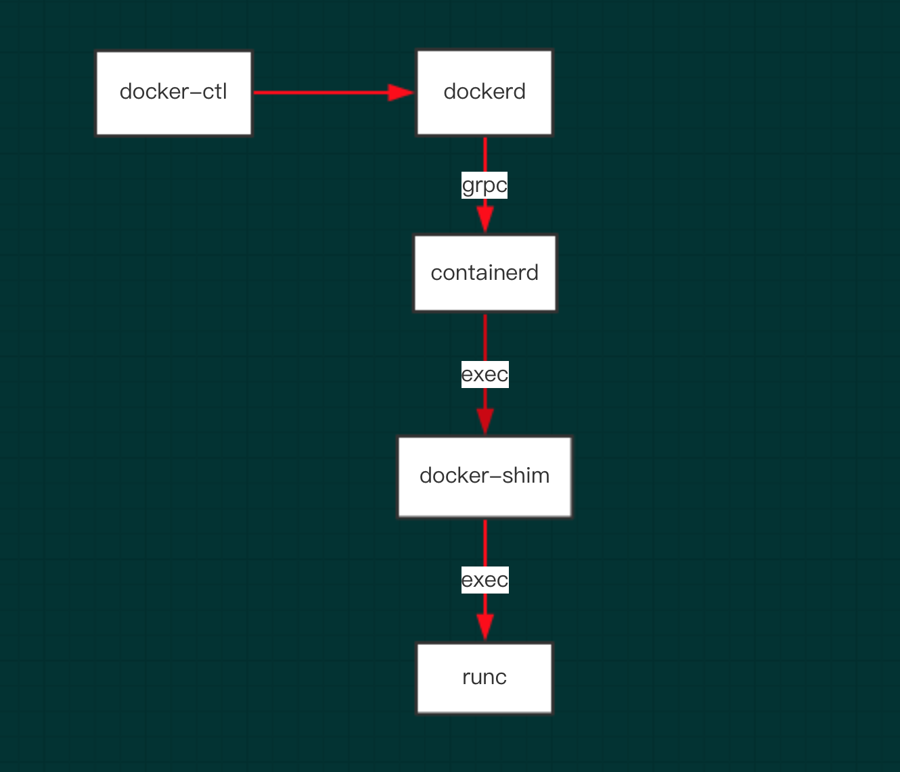
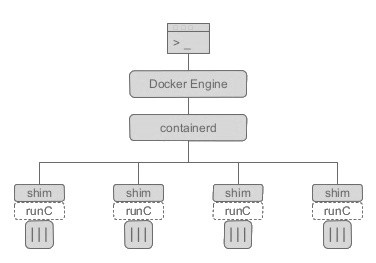

= docker，containerd，runc，docker-shim之间的关系
:toc:
:toc-title:
:toclevels: 5
:sectnums:

== dockerd
dockerd本身实属是对容器相关操作的api的最上层封装，直接面向操作用户。

== containerd
dockerd实际真实调用的还是containerd的api接口（rpc方式实现），containerd是dockerd和runc之间的一个中间交流组件。

containerd 主要职责是镜像管理（镜像、元信息等）、容器执行（调用最终运行时组件执行）

containerd 向上为 Docker Daemon 提供了 gRPC 接口，使得 Docker Daemon 屏蔽下面的结构变化，确保原有接口向下兼容。向下通过 containerd-shim 结合 runC，使得引擎可以独立升级，避免之前 Docker Daemon 升级会导致所有容器不可用的问题。

== docker-shim
docker-shim是一个真实运行的容器的真实垫片载体，每启动一个容器都会起一个新的docker-shim的一个进程，
他直接通过指定的三个参数：容器id，boundle目录（containerd的对应某个容器生成的目录，一般位于：/var/run/docker/libcontainerd/containerID），
运行是二进制（默认为runc）来调用runc的api创建一个容器（比如创建容器：最后拼装的命令如下：runc create 。。。。。）

== runc
runc是一个命令行工具端，他根据oci（开放容器组织）的标准来创建和运行容器。

runc 实现了 OCI link:https://opencontainers.org/[运行时标准]

OCI 定义了容器运行时标准，runC 是 Docker 按照开放容器格式标准（OCF, Open Container Format）制定的一种具体实现。

runC 是从 Docker 的 libcontainer 中迁移而来的，实现了容器启停、资源隔离等功能。Docker 默认提供了 docker-runc 实现，事实上，通过 containerd 的封装，可以在 Docker Daemon 启动的时候指定 runc 的实现。

我们可以通过启动 Docker Daemon 时增加--add-runtime参数来选择其他的 runC 现。

== docker 架构

其中，containerd 独立负责容器运行时和生命周期（如创建、启动、停止、中止、信号处理、删除等），其他一些如镜像构建、卷管理、日志等由 Docker Daemon 的其他模块处理。

== 参考
- https://www.infoq.cn/article/2017/02/Docker-Containerd-RunC

