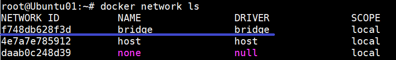
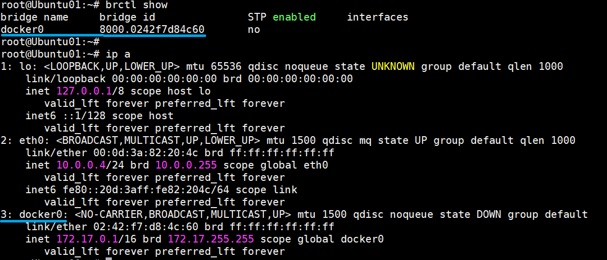
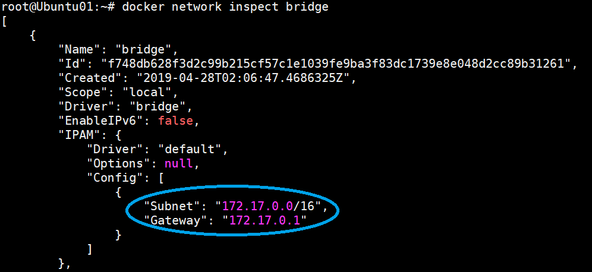
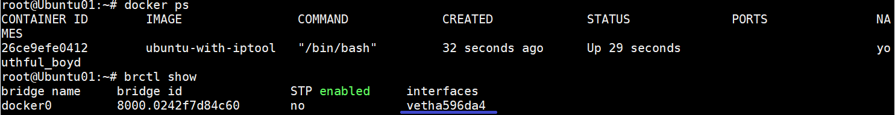
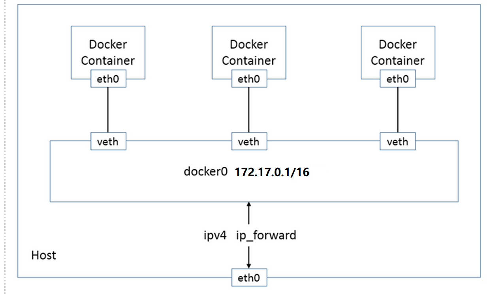
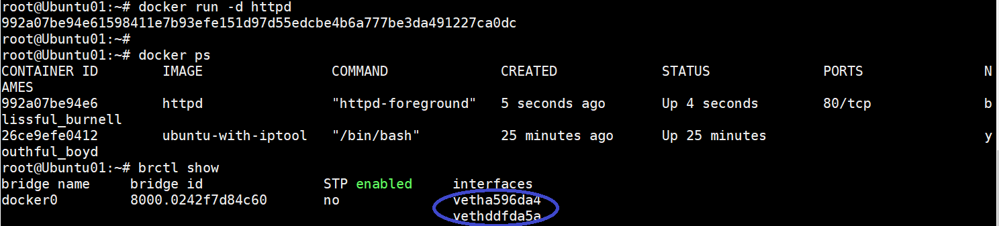
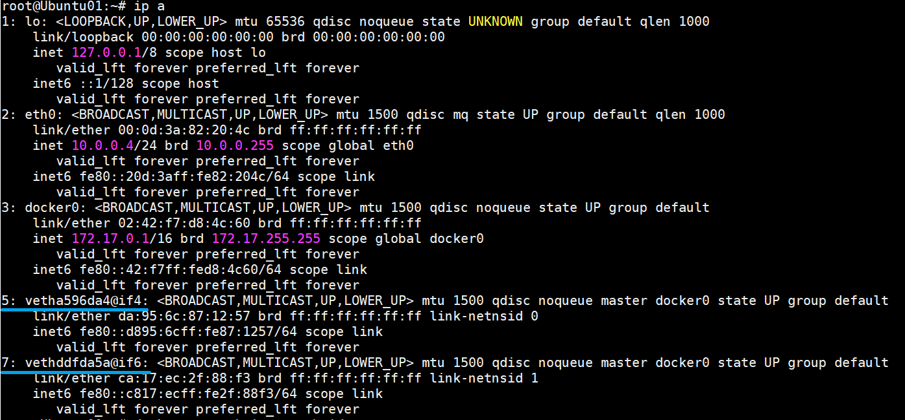
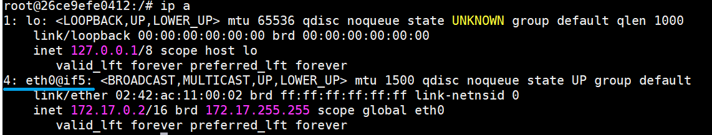
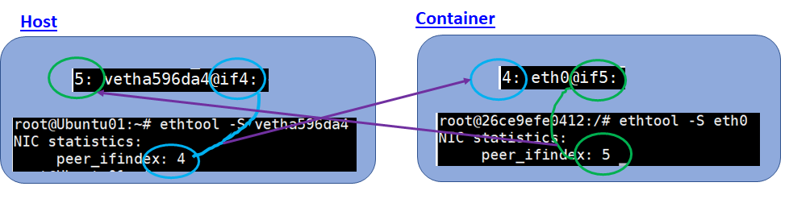

= docker0 网桥 详解
:toc:
:toc-title: 目录
:toclevels: 5
:sectnums:

== 容器虚拟网卡与网桥docker0虚拟网卡的veth pair的配对
=== 背景
Docker 安装时会自动在 host 上创建三个网络：none，host，和bridge；详细说明可参考其它文档。我们可用 docker network ls 命令查看：

基于DRIVER是bridge的网络都会有一个对应的linux bridge被创建：

在默认环境中，一个名为docker0的linux bridge自动被创建好了，其上有一个 docker0 内部接口，IP地址为172.17.0.1/16：

再用docker network inspect指令查看bridge网络：其Gateway就是网卡/接口docker0的IP地址：172.17.0.1。

=== 容器创建时IP地址的分配
Docker 创建一个容器的时候，会执行如下操作：

- 创建一对虚拟接口/网卡，也就是veth pair，分别放到本地主机和新容器中；
- 本地主机一端桥接到默认的 docker0 或指定网桥上，并具有一个唯一的名字，如 vetha596da4；
- 容器一端放到新容器中，并修改名字作为 eth0，这个网卡/接口只在容器的名字空间可见；
- 从网桥可用地址段中（也就是与该bridge对应的network）获取一个空闲地址分配给容器的 eth0，并配置默认路由到桥接网卡 vetha596da4。

完成这些之后，容器就可以使用 eth0 虚拟网卡来连接其他容器和其他网络。

如果不指定--network，创建的容器默认都会挂到 docker0 上，使用本地主机上 docker0 接口的 IP 作为所有容器的默认网关。

当有多个容器创建后，容器网络拓扑结构如下：

这时就会出现如何识别docker0的虚拟网卡和容器的对应关系，例如，图示中有两个容器和docker0中的两个接口：

=== 容器和docker0的虚拟网卡的配对
先在host中查看接口IP地址信息：

并没有IP地址，但接口名字后面有@ifxx的后缀。

再进入容器26ce9efe0412（镜像 ubuntu-with-iptool）中查看IP地址信息：

eth0中出现了编号4和后缀@if5的信息，隐约与主机中编号5和if4的接口有对应关系。

可以利用ethtool来确认这种对应关系：分别在host和container中运行指令"ethtool -S <interface>":

可以清楚地看出来：

host中index=5的接口/网卡vetha596da4的peer inferface index是4；

container中index=4的网卡eth0的peer interface index是5。

注：

- 1) 该方法同样适用于建立在其它bridge上的容器。
- 2) ethtool -S <interface>中如果interface名字带上后缀就会报错：

    root@Ubuntu01:~# ethtool -S vetha596da4@if4
    Cannot get stats strings information: No such device

- 3) ethtool -i <interface>可查看interface的详细信息。

== 参考
- https://www.cnblogs.com/bjtime/p/10773490.html
- https://blog.csdn.net/u011541946/article/details/87826222
- https://www.cnblogs.com/chenqionghe/p/11699466.html

