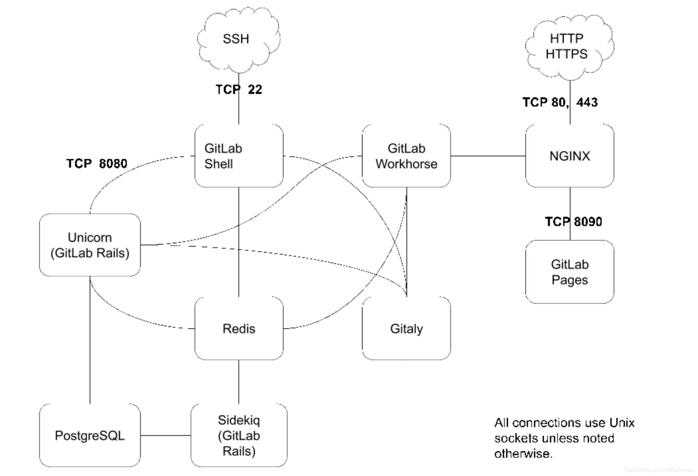

= gitlab 介绍
:toc:
:toclevels: 5
:toc-title:
:sectnums:

== gitlab 架构

|===
|组件名称	|功能说明
|PostgreSQL	|数据库: 持久化数据存放
|Redis	|数据库：缓存信息存放
|Gitlab Shell	|处理通过SSH方式的操作要求，一般为Git命令等操作
|Nginx	|Web应用服务器，用于处理通过HTTP或者HTTPS的用户界面操作
|GitLab Workhorse	|反向代理服务器，可以处理与 Rails 无关的请求（磁盘上的 CSS、JS 文件等），处理 Git Push/Pull 请求，处理到 Rails 的连接（修改由 Rails 发送的响应或发送给 Rails 的请求，管理 Rails 的长期 WebSocket 连接等）
|Unicorn	|Gitlab 自身的 Web 服务器，包含了 Gitlab 主进程，负责处理快速/一般任务，与 Redis 一起工作。工作内容包括：
通过检查存储在 Redis 中的用户会话来检查权限;
为 Sidekiq 制作任务;
从仓库（warehouse）取东西或在那里移动东西;
|Gitaly | 后台服务，专门负责访问磁盘以高效处理 git 操作，并缓存耗时操作。所有的 git 操作都通过 Gitaly 处理
|Sidekiq	|用于执行异步的后台队列任务的功能组件
|GitLab Pages	|GitLab所提供的一项功能，允许用户发布从仓库发布静态的web站点
|===