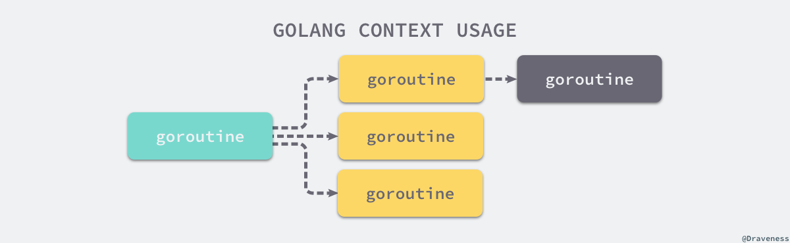

= 上下文 Context
:toc:
:toclevels: 5
:toc-title:
:sectnums:

== 简介
上下文 context.Context 是用来设置截止日期、同步信号，传递请求相关值的结构体。上下文与 Goroutine 有比较密切的关系。context.Context 是 Go 语言中独特的设计，在其他编程语言中我们很少见到类似的概念。

context.Context 是 Go 语言在 1.7 版本中引入标准库的接口1，该接口定义了四个需要实现的方法，其中包括：

- Deadline — 返回 context.Context 被取消的时间，也就是完成工作的截止日期；
- Done — 返回一个 Channel，这个 Channel 会在当前工作完成或者上下文被取消之后关闭，多次调用 Done 方法会返回同一个 Channel；
- Err — 返回 context.Context 结束的原因，它只会在 Done 返回的 Channel 被关闭时才会返回非空的值；
* 如果 context.Context 被取消，会返回 Canceled 错误；
* 如果 context.Context 超时，会返回 DeadlineExceeded 错误；
- Value — 从 context.Context 中获取键对应的值，对于同一个上下文来说，多次调用 Value 并传入相同的 Key 会返回相同的结果，该方法可以用来传递请求特定的数据；

```go
type Context interface {
	Deadline() (deadline time.Time, ok bool)
	Done() <-chan struct{}
	Err() error
	Value(key interface{}) interface{}
}
```

== 设计原理
在 Goroutine 构成的树形结构中对信号进行同步以减少计算资源的浪费是 context.Context 的最大作用。Go 服务的每一个请求的都是通过单独的 Goroutine 处理的2，HTTP/RPC 请求的处理器会启动新的 Goroutine 访问数据库和其他服务。

如下图所示，我们可能会创建多个 Goroutine 来处理一次请求，而 context.Context 的作用就是在不同 Goroutine 之间同步请求特定数据、取消信号以及处理请求的截止日期。



每一个 context.Context 都会从最顶层的 Goroutine 一层一层传递到最下层。context.Context 可以在上层 Goroutine 执行出现错误时，将信号及时同步给下层。

image:images/context2.png[]

如上图所示，当最上层的 Goroutine 因为某些原因执行失败时，下层的 Goroutine 由于没有接收到这个信号所以会继续工作；但是当我们正确地使用 context.Context 时，就可以在下层及时停掉无用的工作以减少额外资源的消耗：

image:images/context2.png[]

我们可以通过一个代码片段了解 context.Context 是如何对信号进行同步的。在这段代码中，我们创建了一个过期时间为 1s 的上下文，并向上下文传入 handle 函数，该方法会使用 500ms 的时间处理传入的『请求』：

```go
func main() {
	ctx, cancel := context.WithTimeout(context.Background(), 1*time.Second)
	defer cancel()

	go handle(ctx, 500*time.Millisecond)
	select {
	case <-ctx.Done():
		fmt.Println("main", ctx.Err())
	}
}

func handle(ctx context.Context, duration time.Duration) {
	select {
	case <-ctx.Done():
		fmt.Println("handle", ctx.Err())
	case <-time.After(duration):
		fmt.Println("process request with", duration)
	}
}
```
因为过期时间大于处理时间，所以我们有足够的时间处理该『请求』，运行上述代码会打印出如下所示的内容：
```
$ go run context.go
process request with 500ms
main context deadline exceeded
```

handle 函数没有进入超时的 select 分支，但是 main 函数的 select 却会等待 context.Context 的超时并打印出 main context deadline exceeded。

如果我们将处理『请求』时间增加至 1500ms，整个程序都会因为上下文的过期而被中止，：

> 相信这两个例子能够帮助各位读者理解 context.Context 的使用方法和设计原理 — 多个 Goroutine 同时订阅 ctx.Done() 管道中的消息，一旦接收到取消信号就立刻停止当前正在执行的工作。

== 默认上下文
context 包中最常用的方法还是 context.Background、context.TODO，这两个方法都会返回预先初始化好的私有变量 background 和 todo，它们会在同一个 Go 程序中被复用：

```go
func Background() Context {
	return background
}

func TODO() Context {
	return todo
}
```

这两个私有变量都是通过 new(emptyCtx) 语句初始化的，它们是指向私有结构体 context.emptyCtx 的指针，这是最简单、最常用的上下文类型：

```go
type emptyCtx int

func (*emptyCtx) Deadline() (deadline time.Time, ok bool) {
	return
}

func (*emptyCtx) Done() <-chan struct{} {
	return nil
}

func (*emptyCtx) Err() error {
	return nil
}

func (*emptyCtx) Value(key interface{}) interface{} {
	return nil
}
```

从上述代码，我们不难发现 context.emptyCtx 通过返回 nil 实现了 context.Context 接口，它没有任何特殊的功能。

image:images/context4.png[]

从源代码来看，context.Background 和 context.TODO 函数其实也只是互为别名，没有太大的差别。它们只是在使用和语义上稍有不同：

- context.Background 是上下文的默认值，所有其他的上下文都应该从它衍生（Derived）出来；
- context.TODO 应该只在不确定应该使用哪种上下文时使用；

在多数情况下，如果当前函数没有上下文作为入参，我们都会使用 context.Background 作为起始的上下文向下传递。

== 取消信号
context.WithCancel 函数能够从 context.Context 中衍生出一个新的子上下文并返回用于取消该上下文的函数（CancelFunc）。一旦我们执行返回的取消函数，当前上下文以及它的子上下文都会被取消，所有的 Goroutine 都会同步收到这一取消信号。

image:images/context5.png[]

例子参考:

```go
func main() {
	ctx, cancal := context.WithCancel(context.Background())
	go a1(ctx)

	time.Sleep(1 * time.Second)
	cancal()
	time.Sleep(5 * time.Second)
}

func a1(ctx context.Context) {
	go func() {
		select {
		case <-ctx.Done():
			fmt.Println("匿名1。。。。。", ctx.Err())
		}
	}()

	go func() {
		select {
		case <-ctx.Done():
			fmt.Println("匿名2。。。。。", ctx.Err())
		}
	}()

	select {
	case <-ctx.Done():
		fmt.Println("a1 ------------", ctx.Err())
	}
	time.Sleep(1 * time.Second)
	fmt.Println("a1 ===========")
}
```

我们直接从 context.WithCancel 函数的实现来看它到底做了什么：

```go
func WithCancel(parent Context) (ctx Context, cancel CancelFunc) {
	c := newCancelCtx(parent)
	propagateCancel(parent, &c)
	return &c, func() { c.cancel(true, Canceled) }
}
```

- context.newCancelCtx 将传入的上下文包装成私有结构体 context.cancelCtx；
- context.propagateCancel 会构建父子上下文之间的关联，当父上下文被取消时，子上下文也会被取消：

```go
func propagateCancel(parent Context, child canceler) {
	done := parent.Done()
	if done == nil {
		return // 父上下文不会触发取消信号
	}
	select {
	case <-done:
		child.cancel(false, parent.Err()) // 父上下文已经被取消
		return
	default:
	}

	if p, ok := parentCancelCtx(parent); ok {
		p.mu.Lock()
		if p.err != nil {
			child.cancel(false, p.err)
		} else {
			p.children[child] = struct{}{}
		}
		p.mu.Unlock()
	} else {
		go func() {
			select {
			case <-parent.Done():
				child.cancel(false, parent.Err())
			case <-child.Done():
			}
		}()
	}
}
```

上述函数总共与父上下文相关的三种不同的情况：

- 当 parent.Done() == nil，也就是 parent 不会触发取消事件时，当前函数会直接返回；
- 当 child 的继承链包含可以取消的上下文时，会判断 parent 是否已经触发了取消信号；
* 如果已经被取消，child 会立刻被取消；
* 如果没有被取消，child 会被加入 parent 的 children 列表中，等待 parent 释放取消信号；
- 在默认情况下
* 运行一个新的 Goroutine 同时监听 parent.Done() 和 child.Done() 两个 Channel
* 在 parent.Done() 关闭时调用 child.cancel 取消子上下文；

context.propagateCancel 的作用是在 parent 和 child 之间同步取消和结束的信号，保证在 parent 被取消时，child 也会收到对应的信号，不会发生状态不一致的问题。

context.cancelCtx 实现的几个接口方法也没有太多值得分析的地方，该结构体最重要的方法是 cancel，这个方法会关闭上下文中的 Channel 并向所有的子上下文同步取消信号：

```go
func (c *cancelCtx) cancel(removeFromParent bool, err error) {
	c.mu.Lock()
	if c.err != nil {
		c.mu.Unlock()
		return
	}
	c.err = err
	if c.done == nil {
		c.done = closedchan
	} else {
		close(c.done)
	}
	for child := range c.children {
		child.cancel(false, err)
	}
	c.children = nil
	c.mu.Unlock()

	if removeFromParent {
		removeChild(c.Context, c)
	}
}
```

除了 context.WithCancel 之外，context 包中的另外两个函数 context.WithDeadline 和 context.WithTimeout 也都能创建可以被取消的计时器上下文 context.timerCtx：


== 总结
Go 语言中的 context.Context 的主要作用还是在多个 Goroutine 组成的树中同步取消信号以减少对资源的消耗和占用，虽然它也有传值的功能，但是这个功能我们还是很少用到。

在真正使用传值的功能时我们也应该非常谨慎，使用 context.Context 进行传递参数请求的所有参数一种非常差的设计，比较常见的使用场景是传递请求对应用户的认证令牌以及用于进行分布式追踪的请求 ID。

