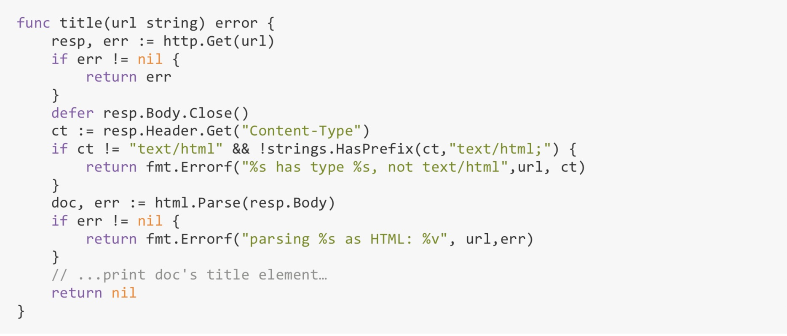

= defer 机制
:toc:
:toclevels: 5
:toc-title:
:sectnums:

== 介绍
当defer语句被 执行时，跟在defer后面的函数会被延迟执行。直到包含该defer语句的函数执行完毕时，defer后的 函数才会被执行，不论包含defer语句的函数是通过return正常结束，还是由于panic导致的异常结 束。你可以在一个函数中执行多条defer语句，它们的执行顺序与声明顺序相反。

defer语句经常被用于处理成对的操作，如打开、关闭、连接、断开连接、加锁、释放锁。通过 defer机制，不论函数逻辑多复杂，都能保证在任何执行路径下，资源被释放。释放资源的defer应 该直接跟在请求资源的语句后。



在处理其他资源时，也可以采用defer机制，比如对文件的操作:

```go
func ReadFile(filename string) ([]byte, error) {
	f, err := os.Open(filename)
	if err != nil {
		return nil, err
	}
	defer f.Close()
	// It's a good but not certain bet that FileInfo will tell us exactly how much to
	// read, so let's try it but be prepared for the answer to be wrong.
	var n int64 = bytes.MinRead

	if fi, err := f.Stat(); err == nil {
		// As initial capacity for readAll, use Size + a little extra in case Size
		// is zero, and to avoid another allocation after Read has filled the
		// buffer. The readAll call will read into its allocated internal buffer
		// cheaply. If the size was wrong, we'll either waste some space off the end
		// or reallocate as needed, but in the overwhelmingly common case we'll get
		// it just right.
		if size := fi.Size() + bytes.MinRead; size > n {
			n = size
		}
	}
	return readAll(f, n)
}
```

我们知道，defer语句中的函数会在return语句更新返回值变量后再执行，又因为在函数中定义的匿 名函数可以访问该函数包括返回值变量在内的所有变量，所以，对匿名函数采用defer机制，可以 使其观察函数的返回值。


以double函数为例:

```go

func double(x int) (result int) {
	defer func() {
		fmt.Printf("double(%d) = %d\n", x, result)
	}()
	return x + x
}

func main() {
	result := double(4)
	fmt.Println(result)
}

//output
//double(4) = 8
//8

```

被延迟执行的匿名函数甚至可以修改函数返回给调用者的返回值:

```go
func triple(x int) (result int) {
	defer func() {
		result += x
	}()
	return x + x
}
```

== 总结
- defer 总是在函数介绍之后只执行
- defer 执行顺序与声明顺序相反，如下 :
```go
package main

import (
	"fmt"
)

func a1(values ...interface{}) {
	fmt.Println("======start =======")
	fmt.Println(values)

	defer func() {
		fmt.Println("defer1==========")
	}()

	defer func() {
		fmt.Println("defer2===========")
	}()

	defer func() {
		fmt.Println("defer3 ============")
	}()

	fmt.Println("end")
}

func main() {
	a1()
}

```

output :
```
======start =======
[]
end
defer3 ============
defer2===========
defer1==========
```