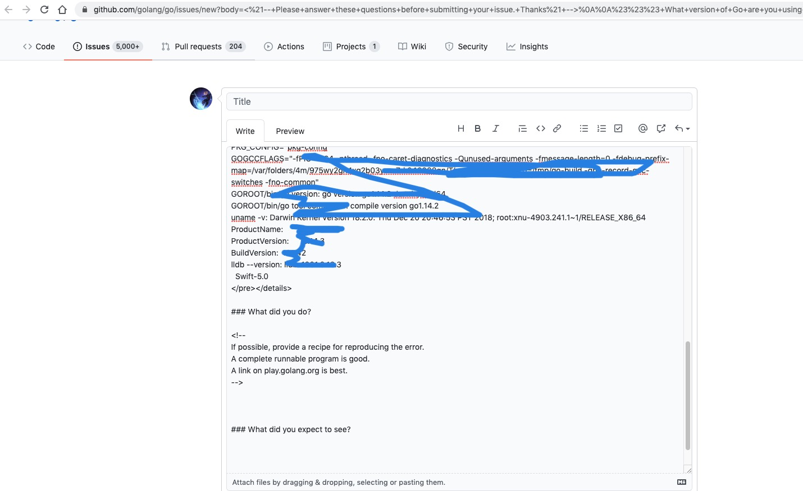

= go bug

== 作用
用于向官方报告新bug

```
go help bug
usage: go bug

Bug opens the default browser and starts a new bug report.
The report includes useful system information.
```

执行 `go bug` 会打开一个github issus 的页面用于描述bug


== 例子
执行 `go bug` 将会弹出



