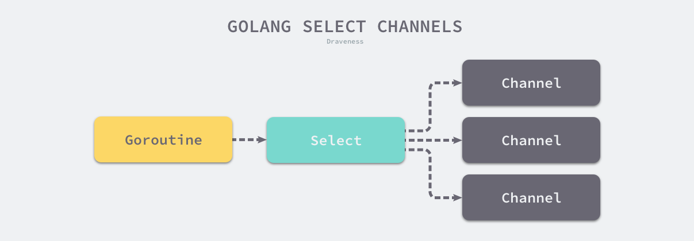
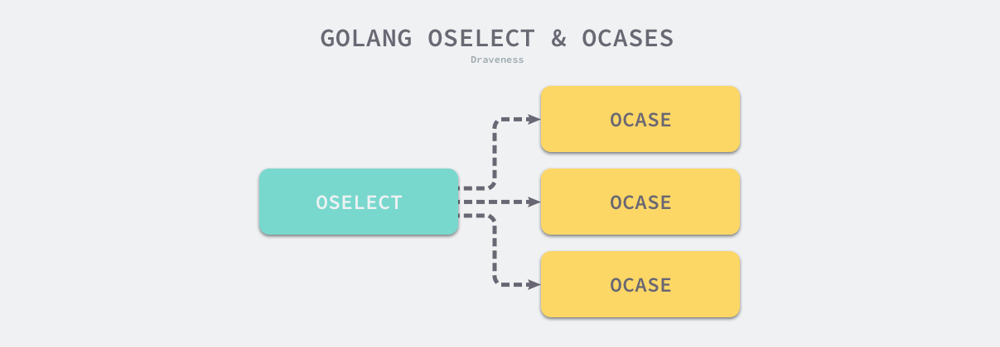

= select 用法
:toc:
:toc-title:
:toclevels:
:sectnums:

== 说明
C 语言中的 select 关键字可以同时监听多个文件描述符的可读或者可写的状态，Go 语言中的 select 关键字也能够让 Goroutine 同时等待多个 Channel 的可读或者可写，在多个文件或者 Channel 发生状态改变之前，select 会一直阻塞当前线程或者 Goroutine。



select 是一种与 switch 相似的控制结构，与 switch 不同的是，select 中虽然也有多个 case，但是这些 case 中的表达式必须都是 Channel 的收发操作。下面的代码就展示了一个包含 Channel 收发操作的 select 结构：

```go
func fibonacci(c, quit chan int) {
	x, y := 0, 1
	for {
		select {
		case c <- x:
			x, y = y, x+y
		case <-quit:
			fmt.Println("quit")
			return
		}
	}
}

```

上述控制结构会等待 c <- x 或者 <-quit 两个表达式中任意一个的返回。无论哪一个表达式返回都会立刻执行 case 中的代码，当 select 中的两个 case 同时被触发时，就会随机选择一个 case 执行。

== 现象
当我们在 Go 语言中使用 select 控制结构时，会遇到两个有趣的现象：

- select 能在 Channel 上进行非阻塞的收发操作；
- select 在遇到多个 Channel 同时响应时会随机挑选 case 执行；

这两个现象是学习 select 时经常会遇到的，我们来深入了解具体的场景并分析这两个现象背后的设计原理。

=== 非阻塞的收发
在通常情况下，select 语句会阻塞当前 Goroutine 并等待多个 Channel 中的一个达到可以收发的状态。但是如果 select 控制结构中包含 default 语句，那么这个 select 语句在执行时会遇到以下两种情况：

- 当存在可以收发的 Channel 时，直接处理该 Channel 对应的 case；
- 当不存在可以收发的 Channel 是，执行 default 中的语句；

当我们运行下面的代码时就不会阻塞当前的 Goroutine，它会直接执行 default 中的代码并返回。

```go
func main() {
	ch := make(chan int)
	select {
	case i := <-ch:
		println(i)

	default:
		println("default")
	}
}
```

只要我们稍微想一下，就会发现 Go 语言设计的这个现象就非常合理。select 的作用就是同时监听多个 case 是否可以执行，如果多个 Channel 都不能执行，那么运行 default 中的代码也是理所当然的。

非阻塞的 Channel 发送和接收操作还是很有必要的，在很多场景下我们不希望向 Channel 发送消息或者从 Channel 中接收消息会阻塞当前 Goroutine，我们只是想看看 Channel 的可读或者可写状态。下面就是一个常见的例子：

```go
errCh := make(chan error, len(tasks))
wg := sync.WaitGroup{}
wg.Add(len(tasks))
for i := range tasks {
    go func() {
        defer wg.Done()
        if err := tasks[i].Run(); err != nil {
            errCh <- err
        }
    }()
}
wg.Wait()

select {
case err := <-errCh:
    return err
default:
    return nil
}
```

在上面这段代码中，我们不关心到底多少个任务执行失败了，只关心是否存在返回错误的任务，最后的 select 语句就能很好地完成这个任务。然而使用 select 的语法不是最原始的设计，它在最初版本使用 x, ok := <-c 的语法实现非阻塞的收发，以下是与非阻塞收发的相关提交：

=== 随机执行
另一个使用 select 遇到的情况是同时有多个 case 就绪时，select 会选择那个 case 执行的问题，我们通过下面的代码可以简单了解一下：

```go
func main() {
	ch := make(chan int)
	go func() {
		for range time.Tick(1 * time.Second) {
			ch <- 0
		}
	}()

	for {
		select {
		case <-ch:
			println("case1")
		case <-ch:
			println("case2")
		}
	}
}
```

从上述代码输出的结果中我们可以看到，select 在遇到多个 <-ch 同时满足可读或者可写条件时会随机选择一个 case 执行其中的代码。

=== 实现原理
select 语句在编译期间会被转换成 OSELECT 节点。每一个 OSELECT 节点都会持有一组 OCASE 节点，如果 OCASE 的执行条件是空，那就意味着这是一个 default 节点:



上图展示的就是 select 语句在编译期间的结构，每一个 OCASE 既包含执行条件也包含满足条件后执行的代码。

编译器在中间代码生成期间会根据 select 中 case 的不同对控制语句进行优化，这一过程都发生在 cmd/compile/internal/gc.walkselectcases 函数中，我们在这里会分四种情况介绍处理的过程和结果：

- select 不存在任何的 case；
- select 只存在一个 case；
- select 存在两个 case，其中一个 case 是 default；
- select 存在多个 case；

上述的四种情况不仅会涉及编译器的重写和优化，还会涉及 Go 语言的运行时机制，我们会从编译期间和运行时两方面分析上述情况。

==== 直接阻塞
空的 select 语句会直接阻塞当前的 Goroutine，导致 Goroutine 进入无法被唤醒的永久休眠状态。

==== 单一管道
如果当前的 select 条件只包含一个 case，那么就会将 select 改写成 if 条件语句。下面展示了原始的 select 语句和被改写、优化后的代码：

```go
// 改写前
select {
case v, ok <-ch: // case ch <- v
    ...
}

// 改写后
if ch == nil {
    block()
}
v, ok := <-ch // case ch <- v
...
```

在处理单操作 select 语句时，会根据 Channel 的收发情况生成不同的语句。当 case 中的 Channel 是空指针时，就会直接挂起当前 Goroutine 并永久休眠。

==== 非阻塞操作
当 select 中仅包含两个 case，并且其中一个是 default 时，Go 语言的编译器就会认为这是一次非阻塞的收发操作。cmd/compile/internal/gc.walkselectcases 函数会对这种情况单独处理，不过在正式优化之前，该函数会将 case 中的所有 Channel 都转换成指向 Channel 的地址。我们会分别介绍非阻塞发送和非阻塞接收时，编译器进行的不同优化。

===== 发送
首先是 Channel 的发送过程，当 case 中表达式的类型是 OSEND 时，编译器会使用 if/else 语句和 runtime.selectnbsend 函数改写代码：

```go
select {
case ch <- i:
    ...
default:
    ...
}

if selectnbsend(ch, i) {
    ...
} else {
    ...
}
```

这段代码中最重要的就是 runtime.selectnbsend 函数，它为我们提供了向 Channel 非阻塞地发送数据的能力。我们在 Channel 一节介绍了向 Channel 发送数据的 runtime.chansend 函数包含一个 block 参数，该参数会决定这一次的发送是不是阻塞的：

```go
func selectnbsend(c *hchan, elem unsafe.Pointer) (selected bool) {
	return chansend(c, elem, false, getcallerpc())
}
```

由于我们向 runtime.chansend 函数传入了 false，所以哪怕是不存在接收方或者缓冲区空间不足都不会阻塞当前 Goroutine 而是会直接返回。

===== 接收
由于从 Channel 中接收数据可能会返回一个或者两个值，所以接受数据的情况会比发送稍显复杂，不过改写的套路是差不多的：

```go
// 改写前
select {
case v <- ch: // case v, ok <- ch:
    ......
default:
    ......
}

// 改写后
if selectnbrecv(&v, ch) { // if selectnbrecv2(&v, &ok, ch) {
    ...
} else {
    ...
}
```

返回值数量不同会导致使用函数的不同，两个用于非阻塞接收消息的函数 runtime.selectnbrecv 和 runtime.selectnbrecv2 只是对 runtime.chanrecv 返回值的处理稍有不同：

```go
func selectnbrecv(elem unsafe.Pointer, c *hchan) (selected bool) {
	selected, _ = chanrecv(c, elem, false)
	return
}

func selectnbrecv2(elem unsafe.Pointer, received *bool, c *hchan) (selected bool) {
	selected, *received = chanrecv(c, elem, false)
	return
}
```

因为接收方不需要，所以 runtime.selectnbrecv 会直接忽略返回的布尔值，而 runtime.selectnbrecv2 会将布尔值回传给调用方。与 runtime.chansend 一样，runtime.chanrecv 也提供了一个 block 参数用于控制这一次接收是否阻塞。

=== 常见流程
在默认的情况下，编译器会使用如下的流程处理 select 语句：

- 将所有的 case 转换成包含 Channel 以及类型等信息的 runtime.scase 结构体；
- 调用运行时函数 runtime.selectgo 从多个准备就绪的 Channel 中选择一个可执行的 runtime.scase 结构体；
- 通过 for 循环生成一组 if 语句，在语句中判断自己是不是被选中的 case

一个包含三个 case 的正常 select 语句其实会被展开成如下所示的逻辑，我们可以看到其中处理的三个部分：

```go
selv := [3]scase{}
order := [6]uint16
for i, cas := range cases {
    c := scase{}
    c.kind = ...
    c.elem = ...
    c.c = ...
}
chosen, revcOK := selectgo(selv, order, 3)
if chosen == 0 {
    ...
    break
}
if chosen == 1 {
    ...
    break
}
if chosen == 2 {
    ...
    break
}
```

== 小结
我们简单总结一下 select 结构的执行过程与实现原理，首先在编译期间，Go 语言会对 select 语句进行优化，它会根据 select 中 case 的不同选择不同的优化路径：

- 空的 select 语句会被转换成 runtime.block 函数的调用，直接挂起当前 Goroutine；
- 如果 select 语句中只包含一个 case，就会被转换成 if ch == nil { block }; n; 表达式；
* 首先判断操作的 Channel 是不是空的；
* 然后执行 case 结构中的内容；
- 如果 select 语句中只包含两个 case 并且其中一个是 default，那么会使用 runtime.selectnbrecv 和 runtime.selectnbsend 非阻塞地执行收发操作；
- 在默认情况下会通过 runtime.selectgo 函数获取执行 case 的索引，并通过多个 if 语句执行对应 case 中的代码；

在编译器已经对 select 语句进行优化之后，Go 语言会在运行时执行编译期间展开的 runtime.selectgo 函数，该函数会按照以下的流程执行：

- 随机生成一个遍历的轮询顺序 pollOrder 并根据 Channel 地址生成锁定顺序 lockOrder；
- 根据 pollOrder 遍历所有的 case 查看是否有可以立刻处理的 Channel；
* 如果存在就直接获取 case 对应的索引并返回；
* 如果不存在就会创建 runtime.sudog 结构体，将当前 Goroutine 加入到所有相关 Channel 的收发队列，并调用 runtime.gopark 挂起当前 Goroutine 等待调度器的唤醒；
- 当调度器唤醒当前 Goroutine 时就会再次按照 lockOrder 遍历所有的 case，从中查找需要被处理的 runtime.sudog 结构对应的索引；

select 关键字是 Go 语言特有的控制结构，它的实现原理比较复杂，需要编译器和运行时函数的通力合作。


== 参考
- https://draveness.me/golang/docs/part2-foundation/ch05-keyword/golang-select/
