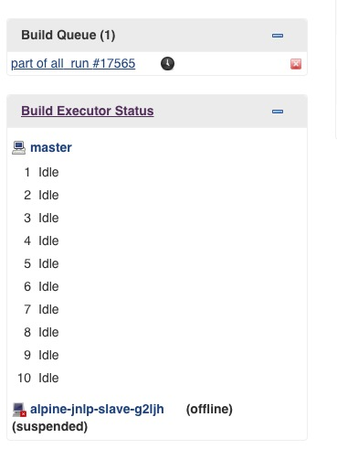
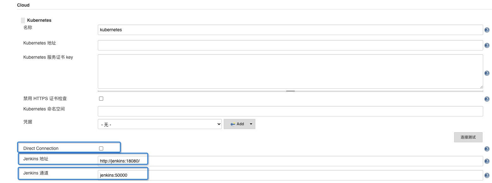

= 记一次jenkins agent 启动慢的问题
:toc:
:toc-title: 目录
:toclevels: 5
:sectnums:

== 背景
在kebernetes 中运行jenkins ，jenkins agent 以动态的方式启动

== 现象
当需要运行job,动态启动jenkins agent 时，经常失败，或者启动时间很长，在限定的时间内无法正常工作，如:



== 问题定位
通过 kubectl describe po 查看 pod 的相关信息


```
[root@xxx ~]# kubectl describe po alpine-jnlp-slave-6hh71
...

jnlp:
    Container ID:   docker://7ee24e06249b5efc56bd5cce88d055190b91231d004b51bb85623172081c9378
    Image:          jenkins/jnlp-slave:3.35-5-alpine
    Image ID:       docker-pullable://jenkins/jnlp-slave@sha256:b21cf35bf498b48fdca62ecaf8800ea9e6bacb8ffd68a45b1d78143368533ae1
    Port:           <none>
    Host Port:      <none>
    State:          Running
      Started:      Tue, 16 Jun 2020 14:47:17 +0800
    Ready:          True
    Restart Count:  0
    Environment:
      JENKINS_PROTOCOLS:          JNLP4-connect
      JENKINS_SECRET:             0cc7d837a7e74a3d0d112461fbbeb84115fcd5abc6cd6502e0084627128d2bea
      JENKINS_AGENT_NAME:         alpine-jnlp-slave-6hh71
      JENKINS_DIRECT_CONNECTION:  120.26.xxx.xxx:50000
      JENKINS_INSTANCE_IDENTITY:  MIIBIjANBgkqhkiG9w0BAQEFAAOCAQ8AMIIBCgKCAQEAkgkuF1WBZuugmVFsd7V6BjXQu9zY8haZyER7W7HjwK8nAIN/Q78VCcFBqhKjlJYKPIEmCd8BnwohjI2K3JcDALLiwN5cL2P2SQ7nEnfalaB0kqHAwX1BkDGUcytav6uthN6PBmqsioQ7IGAqxbsMJ9m7FC1xHCbt2zr3Rkpc8SFvA1LDvpvnCzYj6kXePFxzmZlS0Qo665F7aGcw6EUTmPNGb7hho+lpvyOvXDyRkbGGkegy0tb72AZzKk3DJinSsI0qNsVRVreu+dhRQ5FAW21mRkHLiAzf7dxwOHsvVS82GOZhwRh1CboGXqmYHWQoNDtDTZXF4Cy+BtAR2za0ZQIDAQAB
      JENKINS_NAME:               alpine-jnlp-slave-6hh71
      JENKINS_AGENT_WORKDIR:      /home/jenkins/agent
    Mounts:
      /bin/docker from volume-2 (rw)
      /home/jenkins/agent from workspace-volume (rw)
      /root/.ssh from volume-0 (rw)
      /var/run/docker.sock from volume-1 (rw)
      /var/run/secrets/kubernetes.io/serviceaccount from jenkins-token-fmtkg (ro)

...
```

发现agent 和 master 通信是通过外网通信的，导致很慢

== 问题解决
把外网地址换成k8s service name , 方法参见


再次通过 kubectl describe po 查看 pod 的相关信息

```
[root@xxx ~]# kubectl describe po alpine-jnlp-slave-b9nb2
...

jnlp:
    Container ID:   docker://3d151ecc63c06f6db9731eca8fb88f87975e49872327f2e71970e39f0db1a096
    Image:          jenkins/jnlp-slave:3.35-5-alpine
    Image ID:       docker-pullable://jenkins/jnlp-slave@sha256:b21cf35bf498b48fdca62ecaf8800ea9e6bacb8ffd68a45b1d78143368533ae1
    Port:           <none>
    Host Port:      <none>
    State:          Running
      Started:      Tue, 16 Jun 2020 15:05:40 +0800
    Ready:          True
    Restart Count:  0
    Environment:
      JENKINS_SECRET:         f7cfee24f5ed83a6d013f2da564bd5619dc644f86fa6f84c8d25d8394b295294
      JENKINS_TUNNEL:         jenkins:50000
      JENKINS_AGENT_NAME:     alpine-jnlp-slave-b9nb2
      JENKINS_NAME:           alpine-jnlp-slave-b9nb2
      JENKINS_AGENT_WORKDIR:  /home/jenkins/agent
      JENKINS_URL:            http://jenkins:18080/
    Mounts:
      /bin/docker from volume-2 (rw)
      /home/jenkins/agent from workspace-volume (rw)
      /root/.ssh from volume-0 (rw)
      /var/run/docker.sock from volume-1 (rw)
      /var/run/secrets/kubernetes.io/serviceaccount from jenkins-token-fmtkg (ro)

...
```

到此问题完美解决
== 总结
默认使用的是 JENKINS_URL 环境变量中的HOSTIP ，需要修改成内网地址
