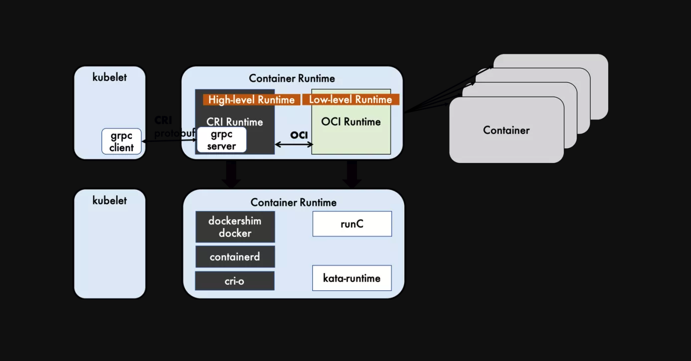

= 容器运行时
:toc:
:sectnums:
:toc-title:
:toclevels: 5

== CRI
CRI是kubernetes定义的一组gRPC服务。Kubelet作为客户端，基于gRPC框架，通过Socket和容器运行时通信。它包括两类服务：镜像服务（Image Service）和运行时服务（Runtime Service）。镜像服务提供下载、检查和删除镜像的远程程序调用。运行时服务包含用于管理容器生命周期，以及与容器交互的调用（exec / attach / port-forward）的远程程序调用。

dockershim, containerd 和cri-o都是遵循CRI的容器运行时，我们称他们为高层级运行时（High-level Runtime）。

== OCI
OCI（Open Container Initiative，开放容器计划）定义了创建容器的格式和运行时的开源行业标准，包括镜像规范（Image Specification）和运行时规范(Runtime Specification)。

镜像规范定义了OCI 镜像的标准。如图2所示，高层级运行时将会下载一个OCI 镜像，并把它解压成OCI 运行时文件系统包（filesystem bundle）。

运行时规范则描述了如何从OCI 运行时文件系统包运行容器程序，并且定义它的配置、运行环境和生命周期。如何为新容器设置命名空间(namepsaces)和控制组(cgroups)，以及挂载根文件系统等等操作，都是在这里定义的。它的一个参考实现是runC。我们称其为低层级运行时（Low-level Runtime）。除runC以外，也有很多其他的运行时遵循OCI标准，例如kata-runtime。

== 参考
- https://mp.weixin.qq.com/s/9dhmQeCPuA_TysMwhzKqGA

