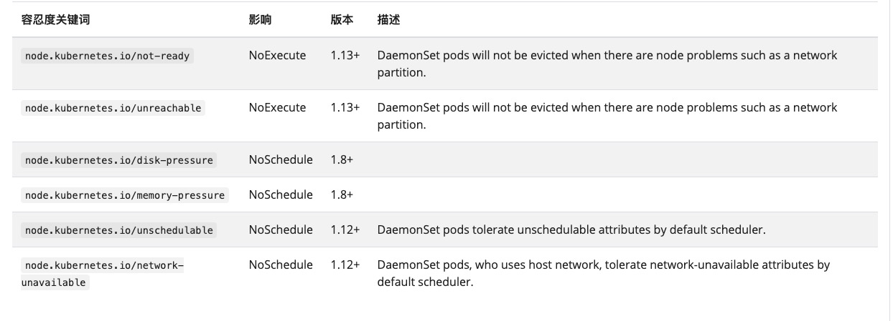

= DaemonSet
:toc:
:toc-title: 目录
:toclevels: 5
:sectnums:

== 概述

DaemonSet 确保全部（或者某些）节点上运行一个 Pod 的副本。当有节点加入集群时， 也会为他们新增一个 Pod 。当有节点从集群移除时，这些 Pod 也会被回收。删除 DaemonSet 将会删除它创建的所有 Pod。

DaemonSet 的一些典型用法：

在每个节点上运行集群存储 DaemonSet，例如 glusterd、ceph。
在每个节点上运行日志收集 DaemonSet，例如 fluentd、logstash。
在每个节点上运行监控 DaemonSet，例如 Prometheus Node Exporter、Flowmill、Sysdig 代理、collectd、Dynatrace OneAgent、AppDynamics 代理、Datadog 代理、New Relic 代理、Ganglia gmond 或者 Instana 代理。
一个简单的用法是在所有的节点上都启动一个 DaemonSet，将被作为每种类型的 daemon 使用。

一个稍微复杂的用法是单独对每种 daemon 类型使用多个 DaemonSet，但具有不同的标志， 并且对不同硬件类型具有不同的内存、CPU 要求。

== DaemonSet Spec
您可以在 YAML 文件中描述 DaemonSet。例如，下面的 daemonset.yaml 文件描述了一个运行 fluentd-elasticsearch Docker 镜像的 DaemonSet：

controllers/daemonset.yaml

```yaml
apiVersion: apps/v1
kind: DaemonSet
metadata:
  name: fluentd-elasticsearch
  namespace: kube-system
  labels:
    k8s-app: fluentd-logging
spec:
  selector:
    matchLabels:
      name: fluentd-elasticsearch
  template:
    metadata:
      labels:
        name: fluentd-elasticsearch
    spec:
      tolerations:
      # this toleration is to have the daemonset runnable on master nodes
      # remove it if your masters can't run pods
      - key: node-role.kubernetes.io/master
        effect: NoSchedule
      containers:
      - name: fluentd-elasticsearch
        image: quay.io/fluentd_elasticsearch/fluentd:v2.5.2
        resources:
          limits:
            memory: 200Mi
          requests:
            cpu: 100m
            memory: 200Mi
        volumeMounts:
        - name: varlog
          mountPath: /var/log
        - name: varlibdockercontainers
          mountPath: /var/lib/docker/containers
          readOnly: true
      terminationGracePeriodSeconds: 30
      volumes:
      - name: varlog
        hostPath:
          path: /var/log
      - name: varlibdockercontainers
        hostPath:
          path: /var/lib/docker/containers
```

== 必需字段
和其它所有 Kubernetes 配置一样，DaemonSet 需要 apiVersion、kind 和 metadata 字段。有关配置文件的基本信息，详见文档 部署应用、配置容器 和 使用 kubectl 进行对象管理。

DaemonSet 也需要一个 .spec 配置段。

=== Pod 模板
.spec 中唯一必需的字段是 .spec.template

.spec.template 是一个 Pod 模板。除了它是嵌套的，而且不具有 apiVersion 或 kind 字段，它与 Pod 具有相同的 schema。

除了 Pod 必需字段外，在 DaemonSet 中的 Pod 模板必须指定合理的标签（查看 Pod Selector）。

在 DaemonSet 中的 Pod 模板必须具有一个值为 Always 的 RestartPolicy，或者未指定它的值，默认是 Always

=== Pod Selector
.spec.selector 字段表示 Pod Selector，它与 Job 的 .spec.selector 的作用是相同的。

从 Kubernetes 1.8 开始，您必须指定与 .spec.template 的标签匹配的 pod selector。当不配置时，pod selector 将不再有默认值。selector 默认与 kubectl apply 不兼容。 此外，一旦创建了 DaemonSet，它的 .spec.selector 就不能修改。修改 pod selector 可能导致 Pod 意外悬浮，并且这对用户来说是困惑的。

spec.selector 表示一个对象，它由如下两个字段组成：

- matchLabels - 与 ReplicationController 的 .spec.selector 的作用相同。
- matchExpressions - 允许构建更加复杂的 Selector，可以通过指定 key、value 列表 ，以及与 key 和 value 列表相关的操作符。

当上述两个字段都指定时，结果表示的是 AND 关系。

如果指定了 .spec.selector，必须与 .spec.template.metadata.labels 相匹配。如果与它们配置的不匹配，则会被 API 拒绝。

另外，通常不应直接通过另一个 DaemonSet 或另一个工作负载资源（例如 ReplicaSet）来创建其标签与该选择器匹配的任何 Pod。否则，DaemonSet 控制器会认为这些 Pod 是由它创建的。Kubernetes 不会阻止你这样做。您可能要执行此操作的一种情况是，手动在节点上创建具有不同值的 Pod 进行测试。

=== 仅在某些节点上运行 Pod
如果指定了 .spec.template.spec.nodeSelector，DaemonSet Controller 将在能够与 Node Selector 匹配的节点上创建 Pod。类似这种情况，可以指定 .spec.template.spec.affinity，然后 DaemonSet Controller 将在能够与 node Affinity 匹配的节点上创建 Pod。 如果根本就没有指定，则 DaemonSet Controller 将在所有节点上创建 Pod。

== 如何调度 Daemon Pods
=== 通过默认 scheduler 调度
DaemonSet 确保所有符合条件的节点都运行该 Pod 的一个副本。通常，运行 Pod 的节点由 Kubernetes 调度器抉择。不过，DaemonSet pods 由 DaemonSet 控制器创建和调度。这将引入以下问题：

- Pod 行为的不一致性：等待调度的正常 Pod 已被创建并处于 Pending 状态，但 DaemonSet pods 未在 Pending 状态下创建。 这使用户感到困惑。
- Pod preemption由默认 scheduler 处理。 启用抢占后，DaemonSet 控制器将在不考虑 pod 优先级和抢占的情况下制定调度决策。

ScheduleDaemonSetPods 允许您使用默认调度器而不是 DaemonSet 控制器来调度 DaemonSets，方法是将 NodeAffinity 添加到 DaemonSet pods，而不是 .spec.nodeName。 然后使用默认调度器将 pod 绑定到目标主机。 如果 DaemonSet pod 的亲和节点已存在，则替换它。 DaemonSet 控制器仅在创建或修改 DaemonSet pods 时执行这些操作，并且不对 DaemonSet 的 spec.template 进行任何更改。

```yaml
nodeAffinity:
  requiredDuringSchedulingIgnoredDuringExecution:
    nodeSelectorTerms:
    - matchFields:
      - key: metadata.name
        operator: In
        values:
        - target-host-name
```

此外，系统会自动添加 node.kubernetes.io/unschedulable：NoSchedule 容忍度到 DaemonSet Pods。 在调度 DaemonSet Pod 时，默认调度器会忽略 unschedulable 节点。

== 污点和容忍度
尽管 Daemon Pods 遵循污点和容忍度 规则，根据相关特性，会自动将以下容忍度添加到 DaemonSet Pods 中。



== 与 Daemon Pods 通信
与 DaemonSet 中的 Pod 进行通信的几种可能模式如下：

- Push：将 DaemonSet 中的 Pod 配置为将更新发送到另一个 Service，例如统计数据库。
- NodeIP 和已知端口：DaemonSet 中的 Pod 可以使用 hostPort，从而可以通过节点 IP 访问到 Pod。客户端能通过某种方法获取节点 IP 列表，并且基于此也可以获取到相应的端口。
- DNS：创建具有相同 Pod Selector 的 Headless Service，然后通过使用 endpoints 资源或从 DNS 中检索到多个 A 记录来发现 DaemonSet。
- Service：创建具有相同 Pod Selector 的 Service，并使用该 Service 随机访问到某个节点上的 daemon（没有办法访问到特定节点）。

== 更新 DaemonSet
如果修改了节点标签，DaemonSet 将立刻向新匹配上的节点添加 Pod，同时删除不能够匹配的节点上的 Pod。

您可以修改 DaemonSet 创建的 Pod。然而，不允许对 Pod 的所有字段进行更新。当下次 节点（即使具有相同的名称）被创建时，DaemonSet Controller 还会使用最初的模板。

您可以删除一个 DaemonSet。如果使用 kubectl 并指定 --cascade=false 选项，则 Pod 将被保留在节点上。然后可以创建具有不同模板的新 DaemonSet。具有不同模板的新 DaemonSet 将能够通过标签匹配并识别所有已经存在的 Pod。 如果有任何 Pod 需要替换，则 DaemonSet 根据它的 updateStrategy 来替换。

== DaemonSet 的可替代选择
=== init 脚本
我们很可能希望直接在一个节点上启动 daemon 进程（例如，使用 init、upstartd、或 systemd）。这非常好，但基于 DaemonSet 来运行这些进程有如下一些好处：

- 像对待应用程序一样，具备为 daemon 提供监控和管理日志的能力。
- 为 daemon 和应用程序使用相同的配置语言和工具（如 Pod 模板、kubectl）。
- 在资源受限的容器中运行 daemon，能够增加 daemon 和应用容器的隔离性。然而，这也实现了在容器中运行 daemon，但却不能在 Pod 中运行（例如，直接基于 Docker 启动）。

== 参考
- https://kubernetes.io/zh/docs/concepts/workloads/controllers/daemonset/

