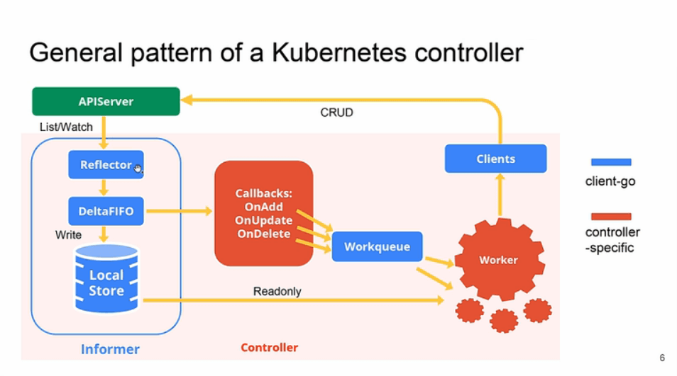

= Kubernetes 复杂有状态应用管理框架 -- Operator
:toc:
:toc-title:
:toclevels: 5
:sectnums:

== 原理
Operator 就是 CRD + Controller。CRD 定义用户的资源；Controller 监听 CRD 对象实例的增、删、改事件，然后执行相应的业务逻辑。

Kubernetes 中的每个资源都是一个 API 对象的集合。除了内置的资源类型，用户还可以自定义资源类型对 Kubernetes API 进行扩展。自定义资源，也可以直接使用 API 或 kubectl 进行操作。

Operator 仅依赖于 Kubernetes 申明式 API 和 Controller 的能力，实现了用户资源与具体操作的定制化关联。

=== CRD
Kubernetes 中的基础资源类型有 Pod、Service、Job、Deployment 等，表达能力有限。Kubernetes 提供了内建的类型 CRD（CustomResourceDefinition），用于自定义资源。 下面是一个定义资源和创建对象的例子:

创建新的资源类型

```yaml
apiVersion: apiextensions.k8s.io/v1beta1
kind: CustomResourceDefinition
metadata:
  # name must match the spec fields below, and be in the form: <plural>.<group>
  name: crontabs.stable.example.com
spec:
  # group name to use for REST API: /apis/<group>/<version>
  group: stable.example.com
  # version name to use for REST API: /apis/<group>/<version>
  version: v1
  # either Namespaced or Cluster
  scope: Namespaced
  names:
    # plural name to be used in the URL: /apis/<group>/<version>/<plural>
    plural: crontabs
    # singular name to be used as an alias on the CLI and for display
    singular: crontab
    # kind is normally the CamelCased singular type. Your resource manifests use this.
    kind: CronTab
    # shortNames allow shorter string to match your resource on the CLI
    shortNames:
    - ct
```

执行命令：

kubectl apply -f resourcedefinition.yaml

Kubernetes 会在 /apis/stable.example.com/v1/namespaces/*/crontabs/... 端点，新建 RESTful API。

创建自定义对象

my-crontab.yaml
```yaml
apiVersion: "stable.example.com/v1"
kind: CronTab
metadata:
  name: my-new-cron-object
spec:
  cronSpec: "* * * * */5"
  image: my-awesome-cron-image
```
执行命令:
```
kubectl apply -f my-crontab.yaml
```
查看对象:
```
kubectl get crontab
```

=== Controller
下面是 Controller 的实现逻辑:



一个 Controller 有一个或多个 Informer 来跟踪某一个资源。Informer 与 apiserver 保持通讯，一旦发现资源发生变化，立即调用 Callbacks，将对象数据放入 Workqueue 中。

Workqueue 作为 Worker 的任务队列。Worker 首先会比较 Workerqueue 中资源对象的状态与预期状态的差别，然后通过 client-go 向 apiserver 发送执行请求，直到达成预期状态。

== 用途
Operator 项目的初衷是，开发者将运维能力固化在代码中，让运维更容易。核心在于对领域能力的实现和封装。

对于无状态应用的部署和管理，Kubernetes 得心应手。而有状态应用往往存在拓扑关系，对某些外部资源有着绑定性的依赖。虽然 Kubernetes 内置了 StatefulSet 有状态对象，但要求开发者在启动命令中添加大量领域逻辑，增加了使用难度。

Operator 的出现，为应用的动态描述提出了一套行之有效的实现规范。

Operator 将分布式应用的使用门槛降到了最低。无论一个分布式应用多么复杂，只要它为用户提供了 Operator ，那么只需要两条命令即可搞定，以 kafka 为例:
```
kubectl apply -f kafka-operator.yaml
kubectl apply -f kafka-cluster.yaml
```
Operator 的用途是管理有状态分布式应用，例如数据库、缓存、监控等。


== 参考
- https://www.chenshaowen.com/blog/complex-application-management-framework-operator-for-kubernetes.html
