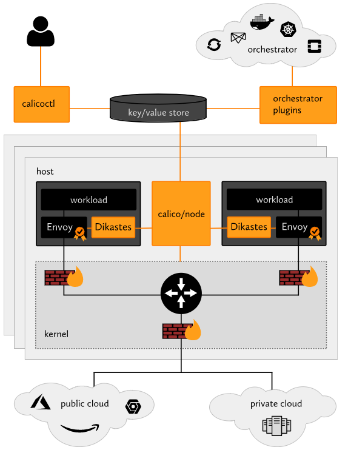
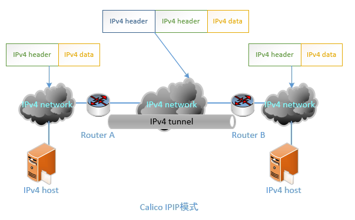
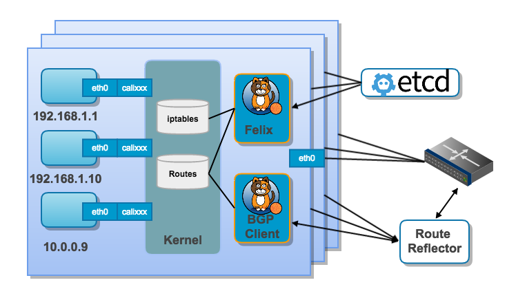

= Calico on Kubernetes
:toc:
:toc-title: 目录
:toclevels: 5
:sectnums:

== 第一部分 How about Calico
=== About Calico
Calico为容器和虚拟机工作负载提供一个安全的网络连接。

Calico可以创建并管理一个3层平面网络，为每个工作负载分配一个完全可路由的IP地址。 工作负载可以在没有IP封装或网络地址转换的情况下进行通信，以实现裸机性能，简化故障排除和提供更好的互操作性。 在需要使用overlay网络的环境中，Calico提供了IP-in-IP隧道技术，或者也可以与flannel等其他overlay网络配合使用。

Calico还提供网络安全规则的动态配置。 使用Calico的简单策略语言，就可以实现对容器、虚拟机工作负载和裸机主机各节点之间通信的细粒度控制。

Calico v3.4于2018.12.10号发布，可与Kubernetes、OpenShift和OpenStack良好地集成使用。

注意: 在Mesos, DC/OS和Docker orchestrators中使用Calico时，目前只支持到了 Calico v2.6.

=== How it works

=== Calico的IPIP与BGP模式
- IPIP是一种将各Node的路由之间做一个tunnel(隧道)，再把两个网络连接起来的模式。启用IPIP模式时，Calico将在各Node上创建一个名为”tunl0″的虚拟网络接口。如下图所示。
- BGP模式则直接使用物理机作为虚拟路由路（vRouter），不再创建额外的tunnel。

=== Calico的部署规模
Calico BGP模式在小规模集群中可以直接互联，在大规模集群中可以通过额外的BGP route reflector来完成。

=== Calico主要组件
Calico利用了Linux内核原生的路由和iptables防火墙功能。 进出各个容器、虚拟机和物理主机的所有流量都会在路由到目标之前遍历这些内核规则

- Felix：主要的Calico代理agent，运行每台计算机上，管理endpoints资源。
- calicoctl：允许从命令行界面配置实现高级策略和网络。
- orchestrator plugins：提供与各种流行的云计算编排工具的紧密集成和同步支持。
- key/value store：存储Calico的策略配置和网络状态信息，目前主要使用etcdv3或k8s api。
- calico/node：在每个主机上运行，从key/value存储中读取相关的策略和网络配置信息，并在Linux内核中实现它。
- Dikastes/Envoy：可选的Kubernetes sidecars，可以通过相互TLS身份验证保护工作负载到工作负载的通信，并增加应用层控制策略。

==== Felix
Felix是一个守护程序，它在每个提供endpoints资源的计算机上运行。在大多数情况下，这意味着它需要在托管容器或VM的宿主机节点上运行。 Felix 负责编制路由和ACL规则以及在该主机上所需的任何其他内容，以便为该主机上的endpoints资源正常运行提供所需的网络连接。

根据特定的编排环境，Felix负责以下任务：

- 管理网络接口，Felix将有关接口的一些信息编程到内核中，以使内核能够正确处理该endpoint发出的流量。 特别是，它将确保主机正确响应来自每个工作负载的ARP请求，并将为其管理的接口启用IP转发支持。它还监视网络接口的出现和消失，以便确保针对这些接口的编程得到了正确的应用。
- 编写路由，Felix负责将到其主机上endpoints的路由编写到Linux内核FIB（转发信息库）中。 这可以确保那些发往目标主机的endpoints的数据包被正确地转发。
- 编写ACLs，Felix还负责将ACLs编程到Linux内核中。 这些ACLs用于确保只能在endpoints之间发送有效的网络流量，并确保endpoints无法绕过Calico的安全措施。
- 报告状态，Felix负责提供有关网络健康状况的数据。 特别是，它将报告配置其主机时发生的错误和问题。 该数据会被写入etcd，以使其对网络中的其他组件和操作才可见。

==== Orchestrator Plugin
每个主要的云编排平台都有单独的Calico网络插件（例如OpenStack，Kubernetes）。 这些插件的目的是将Calico更紧密地绑定到编排工具中，允许用户管理Calico网络，就像他们管理编排工具中内置的网络工具一样。

一个好的Orchestrator插件示例是Calico Neutron ML2 驱动程序。 该插件与Neutron的ML2插件集成，允许用户通过Neutron API调用来配置Calico网络，实现了与Neutron的无缝集成。

Orchestrator插件负责以下任务：

- API Translation，每个云编排工具都不可避免地拥有自己的一套用于管理网络的API接口规范， Orchestrator插件的主要工作就是将这些API转换为Calico的数据模型，然后将其存储在Calico的数据存储区中。这种转换中的一些工作将非常简单，其他一部分可能更复杂，以便将单个复杂操作（例如，实时迁移）转换为Calico网络期望的一系列更简单的操作。
- Feedback，如有需要，orchestrator插件将从Calico网络向编排器提供管理命令的反馈信息。 包括提供有关Felix存活的信息，以及如果网络配置失败则将某些endpoints标记为失败。

==== etcd
etcd是一个分布式键值存储数据库，专注于实现数据存储一致性。 Calico使用etcd提供组件之间的数据通信，并作为可以保证一致性的数据存储，以确保Calico始终可以构建出一个准确的网络。

根据orchestrator插件的不同，etcd既可以是作为主数据存储使用，也可以是一个单独数据存储的轻量级镜像。例如，在OpenStack部署中，OpenStack数据库被认为是“真实配置信息的来源”，而etcd用于镜像其中有关网络配置的信息，并用于服务其他Calico组件。

etcd组件穿插在整个部署中。它可以被分为两组主机节点：核心集群和代理。

对于小型部署，核心集群可以是一个节点的etcd集群（通常与orchestrator插件组件位于同一节点上）。这种部署模型很简单但没有为etcd提供冗余。在etcd失败的情况下，orchstrator插件必须重建数据库，例如OpenStack，它需要插件从OpenStack数据库重新同步状态到etcd。

在较大的部署中，核心群集可以根据etcd管理指南进行扩展。

此外，在运行Felix或orchstrator插件的每台计算机上，会运行一个etcd代理服务。这减少了etcd核心集群上的负载，并为主机节点屏蔽了etcd服务集群的细节。在etcd集群与orchstrator插件在同一台机器上都有成员的情况下，可以放弃在该机器上使用etcd代理。

etcd负责执行以下任务：

- Data Storage，etcd以分布式、一致和容错的方式存储Calico网络的数据（对于至少三个etcd节点的cluster大小）。 这确保Calico网络始终处于已知良好状态，同时允许运行etcd的个别机器节点失败或无法访问。Calico网络数据的这种分布式存储提高了Calico组件从数据库读取的能力。
- Communication，etcd也用作组件之间的通信服务。 我们通过让非etcd组件监视键值空间中的某些点来确保他们看到已经做出的任何更改，从而允许他们及时响应这些更改。 该功能允许将状态信息提交到数据库，然后触发基于该状态数据的进一步网络配置管理。

==== BGP Client (BIRD)
Calico在每个运行Felix服务的节点上都部署一个BGP客户端。 BGP客户端的作用是读取Felix程序编写到内核中并在数据中心内分发的路由信息。

BGP客户端负责执行以下任务：

- 路由信息分发，当Felix将路由插入Linux内核FIB时，BGP客户端将接收它们并将它们分发到集群中的其他工作节点。

==== BGP Route Reflector (BIRD)
对于较大规模的部署，简单的BGP可能成为限制因素，因为它要求每个BGP客户端连接到网状拓扑中的每一个其他BGP客户端。这需要越来越多的连接，迅速变得难以维护，甚至会让一些设备的路由表撑满。

因此，在较大规模的部署中，Calico建议部署BGP Route Reflector。通常是在Internet中使用这样的组件充当BGP客户端连接的中心点，从而防止它们需要与群集中的每个BGP客户端进行通信。为了实现冗余，也可以同时部署多个BGP Route Reflector服务。Route Reflector仅仅是协助管理BGP网络，并没有endpoint数据会通过它们。

在Calico中，此BGP组件也是使用的最常见的BIRD，配置为Route Reflector运行，而不是标准BGP客户端。

BGP Route Reflector负责以下任务：

- 集中式的路由信息分发，当Calico BGP客户端将路由从其FIB通告到Route Reflector时，Route Reflector会将这些路由通告给部署集群中的其他节点。

==== BIRD
BIRD是布拉格查理大学数学与物理学院的一个学校项目，项目名是BIRD Internet Routing Daemon的缩写。 目前，它由CZ.NIC实验室开发和支持。

BIRD项目旨在开发一个功能齐全的动态IP路由守护进程，主要针对（但不限于）Linux，FreeBSD和其他类UNIX系统，并在GNU通用公共许可证下分发。详细信息参照官网https://bird.network.cz/。

作为一个开源的网络路由守护进程项目，BRID设计并支持了以下功能：

- both IPv4 and IPv6 protocols
- multiple routing tables
- the Border Gateway Protocol (BGPv4)
- the Routing Information Protocol (RIPv2, RIPng)
- the Open Shortest Path First protocol (OSPFv2, OSPFv3)
- the Babel Routing Protocol
- the Router Advertisements for IPv6 hosts
- a virtual protocol for exchange of routes between different routing tables on a single host
- a command-line interface allowing on-line control and inspection of status of the daemon
- soft reconfiguration (no need to use complex online commands to change the configuration, just edit the configuration file and notify BIRD to re-read it and it will smoothly switch itself to the new configuration, not disturbing routing protocols unless they are affected by the configuration changes)
- a powerful language for route filtering

== 参考
- https://www.kubernetes.org.cn/4960.html

