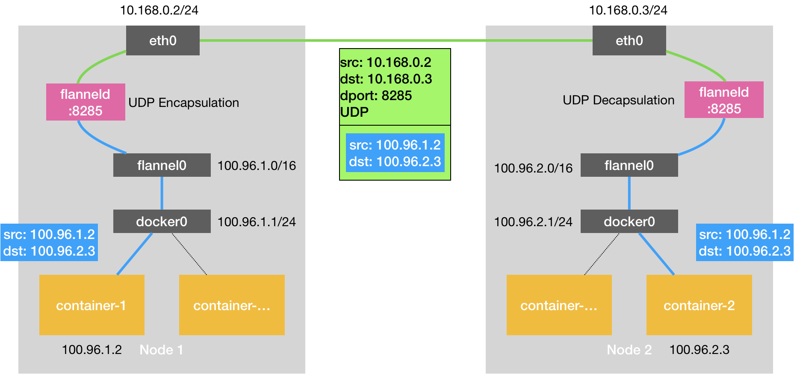
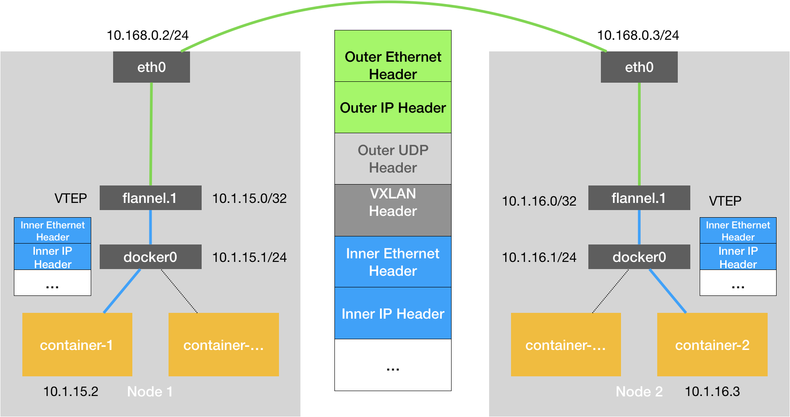
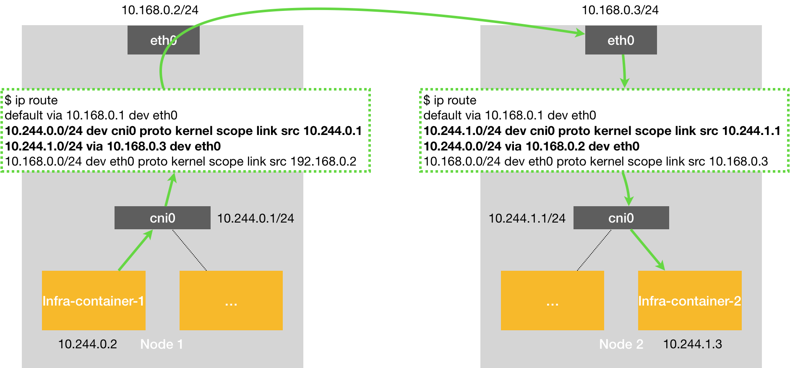

= k8s与flannel网络原理
:toc:
:toc-title: 目录
:toclevels: 5
:sectnums:

== Kubernetes网络插件Flannel的3种工作模式

=== 背景
跨主机通信的一个解决方案是Flannel，由CoreOS推出，支持3种实现：UDP、VXLAN、host-gw

- udp模式：使用设备flannel.0进行封包解包，不是内核原生支持，上下文切换较大，性能非常差
- vxlan模式：使用flannel.1进行封包解包，内核原生支持，性能较强
- host-gw模式：无需flannel.1这样的中间设备，直接宿主机当作子网的下一跳地址，性能最强

host-gw的性能损失大约在10%左右，而其他所有基于VXLAN“隧道”机制 的网络方案，性能损失在20%~30%左右

=== UDP模式（性能差）
核心就是通过TUN设备flannel0实现（TUN设备是工作在三层的虚拟网络设备，功能是：在操作系统内核和用户应用程序之间传递IP包）
相比两台宿主机直接通信，多出了flanneld的处理过程，这个过程，使用了flannel0这个TUN设备，仅在发出IP包的过程中就要经过了三次用户态到内核态的数据拷贝（linux的上下文切换代价比较大），所以性能非常差

以flanel0为例，操作系统将一个IP包发给flanel0，flanel0把IP包发给创建这个设备的应用程序：flanel进程（内核态->用户态）

相反，flanel进程向flanel0发送一个IP包，IP包会出现在宿主机的网络栈中，然后根据宿主机的路由表进行下一步处理（用户态->内核态）

当IP包从容器经过docker0出现在宿主机，又根据路由表进入flanel0设备后，宿主机上的flanneld进程就会收到这个IP包

flannel管理的容器网络里，一台宿主机上的所有容器，都属于该宿主机被分配的“子网”，子网与宿主机的对应关系，存在Etcd中（例如Node1的子网是100.96.1.0/24，container-1的IP地址是100.96.1.2）

当flanneld进程处理flannel0传入的IP包时，就可以根据目的IP地址（如100.96.2.3），匹配到对应的子网（比如100.96.2.0/24），从Etcd中找到这个子网对应的宿主机的IP地址（10.168.0.3）

然后flanneld在收到container-1给container-2的包后，把这个包直接封装在UDP包里，发送给Node2（UDP包的源地址，就是Node1，目的地址是Node2）

每台宿主机的flanneld都监听着8285端口，所以flanneld只要把UDP发给Node2的8285端口就行了。然后Node2的flanneld再把IP包发送给它所管理的TUN设备flannel0，flannel0设备再发给docker0

=== VXLAN模式（性能较好）
什么是VXLAN？

VXLAN，即Virtual Extensible LAN（虚拟可扩展局域网），是Linux本身支持的一网种网络虚拟化技术。VXLAN可以完全在内核态实现封装和解封装工作，从而通过“隧道”机制，构建出覆盖网络（Overlay Network）

VXLAN的设计思想是：

在现有的三层网络之上，“覆盖”一层虚拟的、由内核VXLAN模块负责维护的二层网络，使得连接在这个VXLAN二nfcu网络上的“主机”（虚拟机或容器都可以），可以像在同一个局域网（LAN）里那样自由通信。

为了能够在二nfcu网络上打通“隧道”，VXLAN会在宿主机上设置一个特殊的网络设备作为“隧道”的两端，叫VTEP：VXLAN Tunnel End Point（虚拟隧道端点）
原理如下：

flanel.1设备，就是VXLAN的VTEP，即有IP地址，也有MAC地址

与UPD模式类似，当container-发出请求后，上的地址10.1.16.3的IP包，会先出现在docker网桥，再路由到本机的flannel.1设备进行处理（进站）

为了能够将“原始IP包”封装并发送到正常的主机，VXLAN需要找到隧道的出口：上的宿主机的VTEP设备，这个设备信息，由宿主机的flanneld进程维护

VTEP设备之间通过二层数据桢进行通信

源VTEP设备收到原始IP包后，在上面加上一个目的MAC地址，封装成一个导去数据桢，发送给目的VTEP设备（获取 MAC地址需要通过三层IP地址查询，这是ARP表的功能）

封装过程只是加了一个二层头，不会改变“原始IP包”的内容

这些VTEP设备的MAC地址，对宿主机网络来说没什么实际意义，称为内部数据桢，并不能在宿主机的二层网络传输，Linux内核还需要把它进一步封装成为宿主机的一个普通的数据桢，好让它带着“内部数据桢”通过宿主机的eth0进行传输，Linux会在内部数据桢前面，加上一个我死的VXLAN头，VXLAN头里有一个重要的标志叫VNI，它是VTEP识别某个数据桢是不是应该归自己处理的重要标识。

在Flannel中，VNI的默认值是1，这也是为什么宿主机的VTEP设备都叫flannel.1的原因

一个flannel.1设备只知道另一端flannel.1设备的MAC地址，却不知道对应的宿主机地址是什么。

在linux内核里面，网络设备进行转发的依据，来自FDB的转发数据库，这个flannel.1网桥对应的FDB信息，是由flanneld进程维护的

linux内核再在IP包前面加上二层数据桢头，把Node2的MAC地址填进去。这个MAC地址本身，是Node1的ARP表要学习的，需

Flannel维护，这时候Linux封装的“外部数据桢”的格式如下

然后Node1的flannel.1设备就可以把这个数据桢从eth0发出去，再经过宿主机网络来到Node2的eth0

Node2的内核网络栈会发现这个数据桢有VXLAN Header，并且VNI为1，Linux内核会对它进行拆包，拿到内部数据桢，根据VNI的值，所它交给Node2的flannel.1设备

=== host-gw模式（性能最高）
这是一种纯三层网络的方案，性能最高

howt-gw模式的工作原理，就是将每个Flannel子网的下一跳，设置成了该子网对应的宿主机的IP地址，也就是说，宿主机（host）充当了这条容器通信路径的“网关”（Gateway），这正是host-gw的含义
所有的子网和主机的信息，都保存在Etcd中，flanneld只需要watch这些数据的变化 ，实时更新路由表就行了。
核心是IP包在封装成桢的时候，使用路由表的“下一跳”设置上的MAC地址，这样可以经过二层网络到达目的宿主机

