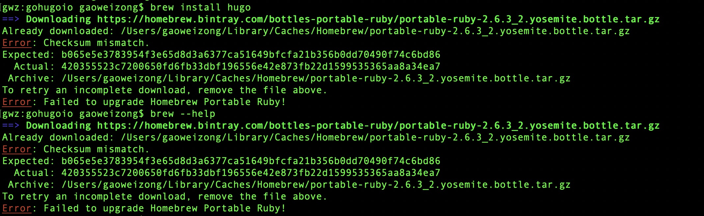

= brew 安装软件时报错
:toc:
:toc-title:
:toclevels:
:sectnums:


== 现象
在安装hugo 是出现如下报错



== 分析
提示已经存在 portable-ruby-2.6.3_2.yosemite.bottle.tar.gz 安装包

== 解决

删除 这个文件即可
```
rm -fr /Users/gaoweizong/Library/Caches/Homebrew/portable-ruby-2.6.3_2.yosemite.bottle.tar.gz
```
