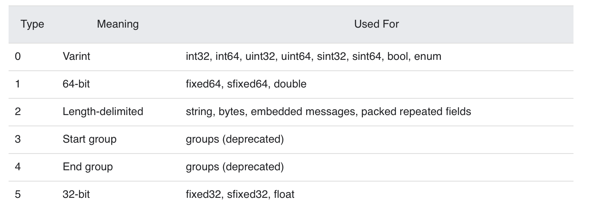
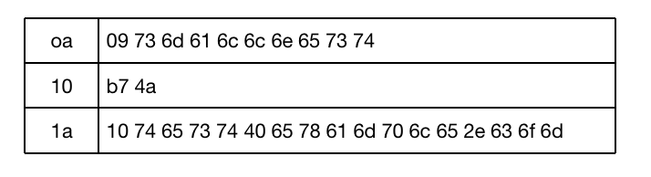
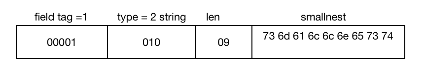
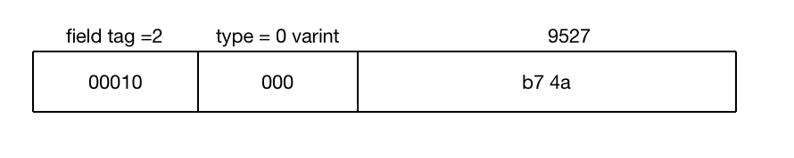
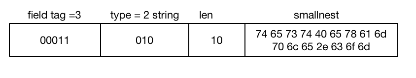

= protobuf-go 用法
:toc:
:toc-title:
:toclevels: 5
:sectnums:


== 安装
go 需要安装一个插件

```
go get -u github.com/golang/protobuf/protoc-gen-go
```

需要在 .proto 文件中申明 go_package

```
option go_package = "example.com/foo/bar";
```

输出的文件目录说明 :

- 默认是以 go_package + proto的文件名 +  .pb.go ,如
```
option go_package = "example.com/foo/bar";
proto 文件名为 : protos/foo.proto
```
最终的文件为 : example.com/foo/bar/foo.pb.go

- 如果设置了 `--go_opt=paths=source_relative` ,则使用和proto文件相同的目录，如 protos/foo.proto
文件产生的文件为 protos/foo.pb.go

== 一个简单的例子
```
syntax = "proto3";
message SearchRequest {
  string query = 1;
  int32 page_number = 2;
  int32 result_per_page = 3;
}
```

第一行指定protobuf的版本，这里是以proto3格式定义。你还可以指定为proto2。如果没有指定，默认以proto2格式定义。

它定义了一个message类型: SearchRequest， 它包含三个字段query、page_number、result_per_page,它会被protoc编译成不同的编程语言的相应对象，比如Java中的class、Go中的struct等。

字段是以[ "repeated" ] type fieldName "=" fieldNumber [ "[" fieldOptions "]" ] ";"格式定义的。这个例子是一个简单的例子，采用了type fieldName "=" fieldNumber格式定义的。

比如第一个字段query, 首先是它的类型string，其次是字段的名称，然后是等号=, 之后是字段的序号，然后是分号。

复杂的结构，前面可以定义为repeated, 序号之后可以定义一些可选项。

这是普通的字段定义，当然还有一些复杂的一些字段定义，比如Oneof、Map、Reserved、enum定义，下一节我们再详细讲。

在当前的目录下执行protoc -I=. -I/usr/local/include -I=$(GOPATH)/src --go_out=. simple.proto, 可以将这个proto编译成Go的代码，因为这里我们使用了go_out输出格式。

-I指定protoc的搜索import的proto的文件夹。在MacOS操作系统中protobuf把一些扩展的proto放在了/usr/local/include对应的文件夹中，一些第三方的Go库放在了gopath对应的包下，所以这里都把它们加上了。对于这个简单的例子，实际是不需要的。

cpp_out用来生成C++代码，java_out产生Java代码，python_out产生python代码，类似地还有csharp_out、objc_out、ruby_out、php_out等参数。

一些第三方的插件也会定义自己的输出插件，比如gofast_out使用gogo库生成代码， rust_out产生rust代码。

生成的代码我们指定放在本地文件夹中(--go_out=.)。


== 引入其它proto文件
```
import  "other.proto";
import public "other2.proto";
import weak "other.proto";
```

比较少使用的是public和weak关键字。默认情况下weak引入的文件允许不存在(missing)，只为了google内部使用。public具有传递性，如果你在文件中通过public引入第三方的proto文件，那么引入你这个文件同时也会引入第三方的proto。

我们一般忽略public和weak关键字，这两个关键字也没有在规范中详细进行介绍。

== option
option可以用在proto的scope中，或者message、enum、service的定义中。
可以是Protobuf定义的option，或者自定义的option。

option的定义格式是"option" optionName "=" constant ";",比如:
```
option java_package = "com.example.foo";
```

一些Protobuf定义的option:

```
java_package
java_multiple_files
java_outer_classname
optimize_for
cc_enable_arenas
objc_class_prefix
deprecated
```

```
option (gogoproto.testgen_all) = true;
option (gogoproto.populate_all) = true;
option (gogoproto.benchgen_all) = true;
message NidRepPackedNative {
	repeated double Field1 = 1 [(gogoproto.nullable) = false, packed = true];
	repeated float Field2 = 2 [(gogoproto.nullable) = false, packed = true];
	repeated int32 Field3 = 3 [(gogoproto.nullable) = false, packed = true];
}
```


== 普通字段
前面讲过，普通字段的格式为field = [ "repeated" ] type fieldName "=" fieldNumber [ "[" fieldOptions "]" ] ";"

repeated允许字段重复，对于Go语言来说，它会编译成数组(slice of type)类型的格式。

其中类型可以是以下几种类型：
```
数字类型： double、float、int32、int64、uint32、uint64、sint32、sint64: 存储长度可变的浮点数、整数、无符号整数和有符号整数
存储固定大小的数字类型：fixed32、fixed64、sfixed32、sfixed64: 存储空间固定
布尔类型: bool
字符串: string
bytes: 字节数组
messageType: 消息类型
enumType:枚举类型
```
字段名、消息名、枚举类型名、map名、服务名等名称首字母必须是字母类型，然后可以是字母、数字或者下划线_。

下面是一个包含各种类型(Scalar Value Types)的proto文件。

```proto
message AllNormalTypes {

  // 20 ~ 30 属于保留序列，不能使用
  reserved 20 to 30 ;

  // 定义 "field19" , "field22" 为保留字段，不能使用
  reserved "field19" , "field22" ;

  double field1 = 1 ;
  float field2 = 2 ;
  int32 field3 = 3 ;
  int64 field4 = 4 ;
  uint32 field5 = 5;
  uint64 field6 = 6 ;
  sint32 field7 = 7 ;
  sint64 field8 = 8 ;
  fixed32 field9 = 9 ;
  fixed64 field10 = 10 ;
  sfixed32 field11 = 11 ;
  sfixed64 field12 = 12 ;
  bool field13 = 13 ;
  string field14 = 14 ;
  bytes field15 = 15 ;
  oneof field16 {
    string field161 = 16 ;
    string field162 = 17;
  }
  map<string,bool> field17 = 18 ;
  EnumAllowAlias field18 = 19 ;


  // string field18 = 21 ; 错误的，因为使用保留的序号21
  // string field19 = 19 ; 错误的，因为使用了保留的字段名称 field19
}

```
编译成Go文件：protoc -I=. -I/usr/local/include -I=$(GOPATH)/src --go_out=. types.proto。

```go
type AllNormalTypes struct {
	state         protoimpl.MessageState
	sizeCache     protoimpl.SizeCache
	unknownFields protoimpl.UnknownFields

	Field1  float64 `protobuf:"fixed64,1,opt,name=field1,proto3" json:"field1,omitempty"`
	Field2  float32 `protobuf:"fixed32,2,opt,name=field2,proto3" json:"field2,omitempty"`
	Field3  int32   `protobuf:"varint,3,opt,name=field3,proto3" json:"field3,omitempty"`
	Field4  int64   `protobuf:"varint,4,opt,name=field4,proto3" json:"field4,omitempty"`
	Field5  uint32  `protobuf:"varint,5,opt,name=field5,proto3" json:"field5,omitempty"`
	Field6  uint64  `protobuf:"varint,6,opt,name=field6,proto3" json:"field6,omitempty"`
	Field7  int32   `protobuf:"zigzag32,7,opt,name=field7,proto3" json:"field7,omitempty"`
	Field8  int64   `protobuf:"zigzag64,8,opt,name=field8,proto3" json:"field8,omitempty"`
	Field9  uint32  `protobuf:"fixed32,9,opt,name=field9,proto3" json:"field9,omitempty"`
	Field10 uint64  `protobuf:"fixed64,10,opt,name=field10,proto3" json:"field10,omitempty"`
	Field11 int32   `protobuf:"fixed32,11,opt,name=field11,proto3" json:"field11,omitempty"`
	Field12 int64   `protobuf:"fixed64,12,opt,name=field12,proto3" json:"field12,omitempty"`
	Field13 bool    `protobuf:"varint,13,opt,name=field13,proto3" json:"field13,omitempty"`
	Field14 string  `protobuf:"bytes,14,opt,name=field14,proto3" json:"field14,omitempty"`
	Field15 []byte  `protobuf:"bytes,15,opt,name=field15,proto3" json:"field15,omitempty"`
	// Types that are assignable to Field16:
	//	*AllNormalTypes_Field161
	//	*AllNormalTypes_Field162
	Field16 isAllNormalTypes_Field16 `protobuf_oneof:"field16"`
	Field17 map[string]bool          `protobuf:"bytes,18,rep,name=field17,proto3" json:"field17,omitempty" protobuf_key:"bytes,1,opt,name=key,proto3" protobuf_val:"varint,2,opt,name=value,proto3"`
	Field18 EnumAllowAlias           `protobuf:"varint,19,opt,name=field18,proto3,enum=EnumAllowAlias" json:"field18,omitempty"`
}
```

== Oneof
如果你有一组字段，同时最多允许这一组中的一个字段出现，就可以使用Oneof定义这一组字段，这有点Union的意思，但是Oneof允许你设置零各值。

因为proto3没有办法区分正常的值是否是设置了还是取得缺省值(比如int64类型字段，如果它的值是0，你无法判断数据是否包含这个字段，因为0几可能是数据中设置的值，也可能是这个字段的零值)，所以你可以通过Oneof取得这个功能，因为Oneof有判断字段是否设置的功能。

```
syntax = "proto3";
package abc;
message OneofMessage {
    oneof test_oneof {
      string name = 4;
      int64 value = 9;
    }
  }
```
oneof字段不能同时使用repeated。

== map类型
map类型需要设置键和值的类型，格式是"map" "<" keyType "," type ">" mapName "=" fieldNumber [ "[" fieldOptions "]"。

比如:

```
map<int64,string> values = 1;
```
map字段不能同时使用repeated。

== Reserved
Reserved可以用来指明此message不使用某些字段，也就是忽略这些字段。

可以通过字段编号范围或者字段名称指定保留的字段：

```
syntax = "proto3";
package abc;
message AllNormalypes {
  reserved 2, 4 to 6;
  reserved "field14", "field11";
  double field1 = 1;
  // float field2 = 2;
  int32 field3 = 3;
  // int64 field4 = 4;
  // uint32 field5 = 5;
  // uint64 field6 = 6;
  sint32 field7 = 7;
  sint64 field8 = 8;
  fixed32 field9 = 9;
  fixed64 field10 = 10;
  // sfixed32 field11 = 11;
  sfixed64 field12 = 12;
  bool field13 = 13;
  // string field14 = 14;
  bytes field15 = 15;
}
```
声明保留的字段你就不要再定义了，否则编译的时候会出错。

== 枚举类型
枚举类型也是常用的一种类型，它限定字段的值只能取某个特定的值，比如星期类型只能取周一到周日七个值。

注意枚举类型的定义采用C++ scoping规则，也就是枚举值是枚举类型的兄弟类型，而不是子类型，所以避免在同一个package定义重名的枚举字段。

```
enum EnumAllowingAlias {
  option allow_alias = true;
  UNKNOWN = 0;
  STARTED = 1;
  RUNNING = 1;
}
enum EnumNotAllowingAlias {
  UNKNOWN2 = 0;
  STARTED2 = 1;
  // RUNNING = 1;
}
```

虽然产生的Go代码会给产生的类型加上前缀，但是proto的定义还是需要避免重名(把上面的STARTED2改成STARTED试试)。

如果设置allow_alias，允许字段编号重复，RUNNING是STARTED的别名。

枚举的常量必须是一个32比特的整数，从效率的角度考虑，不推荐采用负数。

第一个枚举值必须是0，而且必须定义。

你也可以把枚举类型定义到message中：

```
message SearchRequest {
  string query = 1;
  int32 page_number = 2;
  int32 result_per_page = 3;
  enum Corpus {
    UNIVERSAL = 0;
    WEB = 1;
    IMAGES = 2;
    LOCAL = 3;
    NEWS = 4;
    PRODUCTS = 5;
    VIDEO = 6;
  }
  Corpus corpus = 4;
}
```

对于无法识别的枚举值，不同的语言有不同的处理。对于Go语言来说，因为枚举类型以int32来表示，所以对应的值依然用int32解析出来，只不过没有对应的枚举值而已。这种情况还是会存在的，比如proto有改动，或者代码强行设置了一个未知的枚举值。

== 使用其它类型
你也可以使用其它message类型作为字段的类型值。因为前面在介绍字段的类型的时候说了，类型可以是消息类型和枚举类型，枚举类型如上所示，而消息类型如下所示：

```
message SearchResponse {
  repeated Result results = 1;
}
message Result {
  string url = 1;
  string title = 2;
  repeated string snippets = 3;
}
```

如果要使用的类型在其它proto文件中定义，你需要使用import把对应的文件引入进来。

== 嵌套类型
嵌套类型就是消息类型里面定义了消息类型：

```
message SearchResponse {
  message Result {
    string url = 1;
    string title = 2;
    repeated string snippets = 3;
  }
  repeated Result results = 1;
}
```
如果Result不需要共用，只被SearchResponse使用，可以采用这种定义方式， 如果你需要在外部使用这个类型，其实你也可以使用，但是不如把这个内部的消息类型定义抽取出来，除非你有很特别的含义：

```
message SomeOtherMessage {
  SearchResponse.Result result = 1;
}
```

== 未知类型
未知类型是指数据的格式符合Protobuf的定义，但是数据中的某个/某些字段解析器无法识别的字段类型。一般发生在proto文件有变化，新旧数据不一致的情况导致。

proto3最开始对于不能识别的数据就丢弃掉了，但是自3.5 版本后重新引入了未知字段，以匹配proto2的行为。

== Any
Any字段允许你处理嵌套数据，并不需要它的proto定义。一个Any以bytes呈现序列化的消息，并且包含一个URL作为这个类型的唯一标识和元数据。

为了使用Any类型，你需要引入google/protobuf/any.proto。

== 更新消息类型
有时候你不得不修改正在使用的proto文件，比如为类型增加一个字段，protobuf支持这种修改而不影响已有的服务，不过你需要遵循一定的规则：

- 不要改变已有字段的字段编号
- 当你增加一个新的字段的时候，老系统序列化后的数据依然可以被你的新的格式所解析，只不过你需要处理新加字段的缺省值。 老系统也能解析你信息的值，新加字段只不过被丢弃了
- 字段也可以被移除，但是建议你Reserved这个字段，避免将来会使用这个字段
- int32, uint32, int64, uint64 和 bool类型都是兼容的
- sint32 和 sint64兼容，但是不和其它整数类型兼容
- string 和 bytes兼容，如果 bytes 是合法的UTF-8 bytes的话
- 嵌入类型和bytes兼容，如果bytes包含一个消息的编码版本的话
- fixed32和sfixed32, fixed64和sfixed64
- enum和int32, uint32, int64, uint64格式兼容
- 把单一一个值改变成一个新的oneof类型的一个成员是安全和二进制兼容的。把一组字段变成一个新的oneof字段也是安全的，如果你确保这一组字段最多只会设置一个。把一个字段移动到一个已存在的oneof字段是不安全的

== 编码
首先，我们先了解varint方法。varint方法是一种使用变长方式表示整数的方法，可以使用一个或者多个字节来表示小整数和大整数，数越小，使用的字节数越少。

在varint表示的字节中，除了最后一个字节，前面的字节都有一个bit来表示还有字节需要处理，这个标记叫做most significant bit (msb) set。低位放在前面。

比如1表示为0000 0001。最高位0表示这是最后一个字节了，只用一个字节就可以表示。

数字300表示为1010 1100 0000 0010, 两个字节来表示。每个字节高位去掉即可: 010 1100 000 0010,反转000 0010 010 1100,去掉前面的0，也就是100101100, 2^8 + 2^5 + 2^3 + 2^2= 256+32+8+4=300。

Go标准库encoding/binary有对varint处理方法。

事实上。Protobuf是编码的键值对，其中键用varint来表示，其中后三位代表wire type。

Protobuf只定义了6种wire类型。



对于字段比较少(2^4=16)情况，使用一个字节就可以表示key。

我们以一个简单的例子，看看Protobuf是如何进行编码的。

这个例子的proto定义文件为:

```
syntax = "proto3";
option go_package = "main";
message Person {
    string name = 1;
    int32 id = 2;
    repeated string email = 3;
}
```

它定义了Persion这个message，包含三个字段，分别是string, int32和string类型，其中第三个字段允许重复。

定义一个实例：

```
p := &Person{
	Name:  "smallnest",
	Id:    9527,
	Email: []string{"test@example.com"},
   }
```

编码后是一个32字节的数据：



第一个字段的类型是字符串(wire type是2), 字段编号是1 (00000001)， 字段编号左移三位再加上wiretype就是0a(00001010)。



第二个字段的类型是int32(wire type是0), 字段编号是2 (00000010)， 字段编号左移三位再加上wiretype就是10(00010000)。



第三个字段的类型是字符串(wire type是2), 字段编号是3 (00000011)， 字段编号左移三位再加上wiretype就是1a(00011010)。



为了更有效的处理sint32和sint64, Protobuf采用ZigZag编码。

对于固定长度的数字，采用小端序的方式编码（little-endian byte order）。

字符串处理key之外，还需要一个varint记录其长度，然后是UTF-8的字符串值。

嵌入的message和bytes、string一样。

Proto3中对数字类型的repeated字段采用pack处理方式，同一个repeated元素共享同一个key，之后是字段的整体字节长度，然后是各个元素。因为数字类型天生具有可区分性，不需要额外的分隔符进行区分。

== 参考
- https://developers.google.com/protocol-buffers/docs/reference/go-generated
- https://colobu.com/2019/10/03/protobuf-ultimate-tutorial-in-go/
- https://github.com/gogo/protobuf
- https://github.com/gogo/protobuf/blob/master/extensions.md

