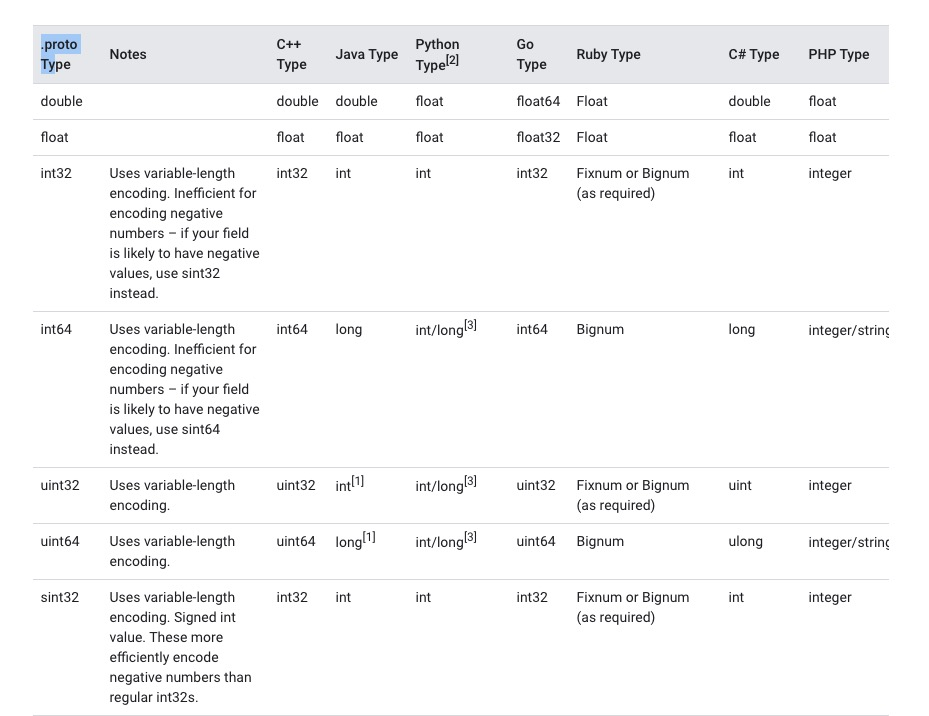
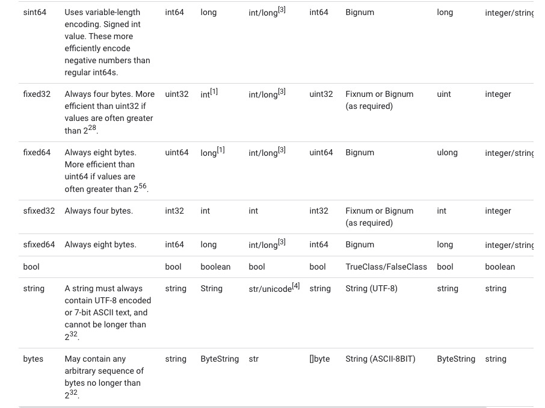

= protobuf 简介
:toc:
:toclevels: 5
:toc-title:
:sectnums:

== 参考
- https://github.com/protocolbuffers/protobuf
- https://developers.google.com/protocol-buffers
- https://developers.google.com/protocol-buffers/docs/overview
- https://colobu.com/2015/01/07/Protobuf-language-guide/
- https://developers.google.com/protocol-buffers/docs/reference/go-generated
- https://colobu.com/2019/10/03/protobuf-ultimate-tutorial-in-go/

== 介绍
Protocol buffers 是Google的语言中立、平台中立、可扩展的结构化数据序列化机制--想想XML，但更小、更快、更简单。您只需定义一次您希望数据的结构化方式，然后您就可以使用特殊生成的源代码轻松地将您的结构化数据写入或从各种数据流中读取，并使用各种语言。

== 语法
=== 定义一个消息类型
先来看一个非常简单的例子。假设你想定义一个“搜索请求”的消息格式，每一个请求含有一个查询字符串、你感兴趣的查询结果所在的页数，以及每一页多少条查询结果。可以采用如下的方式来定义消息类型的.proto文件了：

```proto
message SearchRequest {
  required string query = 1;
  optional int32 page_number = 2;
  optional int32 result_per_page = 3;
}
```

SearchRequest消息格式有3个字段，在消息中承载的数据分别对应于每一个字段。其中每个字段都有一个名字和一种类型。

==== 指定字段类型
在上面的例子中，所有字段都是标量类型：两个整型（page_number和result_per_page），一个string类型（query）。当然，你也可以为字段指定其他的合成类型，包括枚举（enumerations）或其他消息类型。

==== 分配标识号
正如上述文件格式，在消息定义中，每个字段都有唯一的一个数字标识符。这些标识符是用来在消息的二进制格式中识别各个字段的，一旦开始使用就不能够再改变。注：[1,15]之内的标识号在编码的时候会占用一个字节。[16,2047]之内的标识号则占用2个字节。所以应该为那些频繁出现的消息元素保留 [1,15]之内的标识号。切记：要为将来有可能添加的、频繁出现的标识号预留一些标识号。

最小的标识号可以从1开始，最大到2^29 - 1, or 536,870,911。不可以使用其中的[19000－19999]的标识号， Protobuf协议实现中对这些进行了预留。如果非要在.proto文件中使用这些预留标识号，编译时就会报警。

==== 指定字段规则
所指定的消息字段修饰符必须是如下之一：

- singular
- repeated

== Value 类型定义


