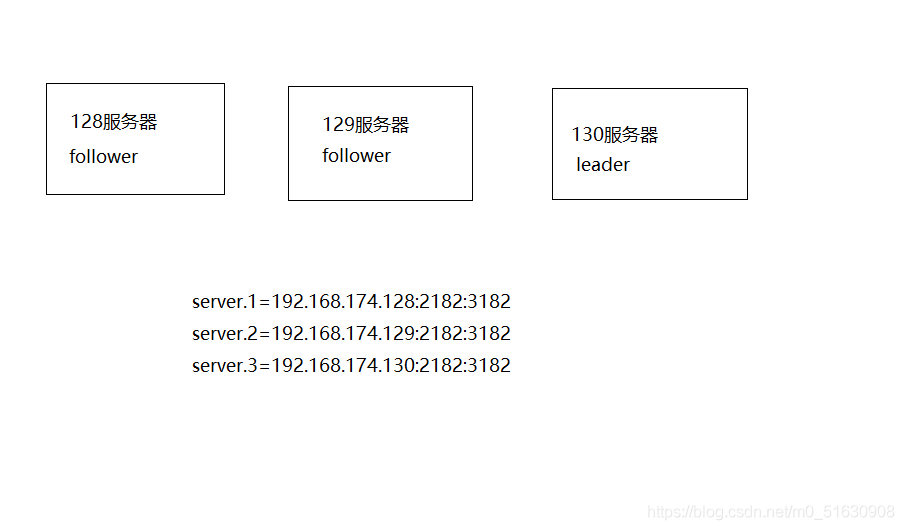

= 关于Zookeeper集群搭建节点数量为什么是2n+1个问题
:toc: left
:toclevels: 5
:sectnums:
:toc-title:

首先我们要先理解一下zookeeper的选举机制

得到的票数/集群的总数 > 50%就成leader（这句话很关键）

- 当启动了130，130就会投自己一票 此时的到的总票数 1/3=30%
- 启动129：

    129与130进行新一轮投票
    129 投自己一票 1/3
    130 投自己一票 1/3
- pk投票

    pk规则（选举的规则）
    3.1. 对比事物id（zxid）谁大就该投谁
    假如出现事物id相同
    3.2. 比较服务器id谁大(myid)，就改投谁。130=3 129=2
    130胜出，129改投130
    130 票数 2/3 = 66% > 50% leader
- 128启动时同理所以130必定当选leader

所以这个时候建议服务器性能比较好，设置他的id值大一些

== 参考
- https://my.oschina.net/u/4408067/blog/4875878
